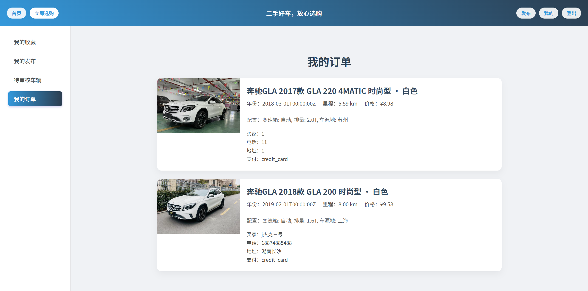

# Django项目前后端分离系统设计日志

注：***引号部分为一些小感想**，以及开发过程中碰到的想记录的地方*

[TOC]


------

# 初步策略

改视图为 JSON API 接口

```python
# views.py
def car_detail(request, car_id):
    car = Car.objects.get(id=car_id)
    return render(request, 'users/car_detail.html', {'car': car})
```

 **改成 JSON API 形式：**

```python
from django.http import JsonResponse
from .models import Car

def car_detail_api(request, car_id):
    try:
        car = Car.objects.get(id=car_id)
        return JsonResponse({
            "id": car.id,
            "brand": car.brand,
            "model": car.model,
            "price": car.price,
            "image": car.image.url if car.image else None,
            "description": car.description,
        })
    except Car.DoesNotExist:
        return JsonResponse({"error": "Car not found"}, status=404)
```

------

开启跨域支持（CORS）

如果你前端用 Vite 跑在 `localhost:5173`，而 Django 是 `localhost:8000`，那么需要开启跨域支持。

安装 CORS 组件：

```bash
pip install django-cors-headers
```

修改 `settings.py`：

```python
INSTALLED_APPS = [
    ...
    'cors headers',
]

MIDDLEWARE = [
    'cors headers.middleware.CorsMiddleware',
    ...
]

# 开放所有域名跨域（开发环境用）
CORS_ALLOW_ALL_ORIGINS = True

# 生产环境建议只允许特定前端域名：
# CORS_ALLOWED_ORIGINS = [
#     "http://localhost:5173",
#     "https://your-frontend-domain.com",
# ]
```

------

## 使用 Django REST framework 暴露接口

有多个模型和复杂接口，建议使用 **DRF（Django REST framework）**：

1. 安装：

```bash
pip install djangorestframework
```

2. 注册到 `settings.py`

```python
INSTALLED_APPS = [
    ...
    'rest_framework',
]
```

------

3. 写一个序列化器（Serializer）

```python
# users/serializers.py
from rest_framework import serializers
from .models import Car

class CarSerializer(serializers.ModelSerializer):
    class Meta:
        model = Car
        fields = '__all__'
```

------

4. 写 API 视图（基于类）

```python
# users/views.py
from rest_framework.views import APIView
from rest_framework.response import Response
from rest_framework import status
from .models import Car
from .serializers import CarSerializer

class CarDetailAPIView(APIView):
    def get(self, request, car_id):
        try:
            car = Car.objects.get(id=car_id)
            serializer = CarSerializer(car)
            return Response(serializer.data)
        except Car.DoesNotExist:
            return Response({"error": "Car not found"}, status=status.HTTP_404_NOT_FOUND)
```

------

5. 添加到 `urls.py`

```python
# users/urls.py
from django.urls import path
from .views import CarDetailAPIView

urlpatterns = [
    path('api/cars/<int:car_id>/', CarDetailAPIView.as_view(), name='car-detail-api'),
]
```

前端现在可以通过 `http://localhost:8000/api/cars/1/` 访问车辆详情接口。

------

其他可选做法

- 批量列表接口也可以写一个 `ListAPIView`
- 用 `ViewSet` 自动生成增删改查接口（后期可以教你）
- 用户登录也可以写成 DRF 的 API（比如 `api/login/`）

------

序列化器

序列化器（Serializer）是计算机编程中用于**将复杂数据结构（如对象、数组、字典等）转换为可存储或传输格式（如字符串、字节流）**的工具，同时支持反向操作（反序列化）。以下是核心要点：

---

**1. 核心功能**

• **序列化**：将内存中的对象转换为JSON、XML等格式，便于网络传输或持久化存储。
• **反序列化**：将接收的数据（如JSON）还原为程序可操作的对象或数据结构。
• **数据校验**：验证输入数据的合法性（如字段长度、类型等）。

---

**2. 主要特性**

• **跨平台性**：支持不同编程语言和系统间的数据交换（如JSON、Protocol Buffers）。
• **性能优化**：高效处理大量数据（如Protocol Buffers二进制格式）。
• **安全性**：防止恶意数据注入（如JWT的签名加密）。

---

**3. 应用场景**

• **Web API开发**：如Django REST框架中，序列化器将模型（Model）转换为JSON响应。
• **数据存储**：将对象序列化后保存到数据库或文件。
• **微服务通信**：服务间通过序列化格式传输数据。

---

**4. 示例（Django REST框架）**

```python
from rest_framework import serializers

class BookSerializer(serializers.Serializer):
    name = serializers.CharField(max_length=32)
    price = serializers.DecimalField(max_digits=5, decimal_places=2)
```
• **序列化**：`BookSerializer(instance=book).data` → 输出JSON。
• **反序列化**：`BookSerializer(data=request.data)` → 验证并保存数据。

---

**5. 常见格式**

• **文本格式**：JSON（可读性强）、XML。
• **二进制格式**：Protocol Buffers（高效）、MessagePack（紧凑）。

序列化器是现代软件开发中数据交互的核心组件，尤其在分布式系统和高性能服务中不可或缺。

## 设计序列化器

```
# 安装Django REST框架的MongoDB支持
pip install django-rest-framework-mongoengine -i https://pypi.tuna.tsinghua.edu.cn/simple
```

users/serializers.py

```
# 写一个序列化器
# users/serializers.py
from rest_framework_mongoengine import serializers
from .models import User, UsedCar, CheckingCar, Admin, Order


class UserSerializer(serializers.DocumentSerializer):
    class Meta:
        model = User
        fields = '__all__'


class UsedCarSerializer(serializers.DocumentSerializer):
    class Meta:
        model = UsedCar
        fields = '__all__'


class CheckingCarSerializer(serializers.DocumentSerializer):
    class Meta:
        model = CheckingCar
        fields = '__all__'


class AdminSerializer(serializers.DocumentSerializer):
    class Meta:
        model = Admin
        fields = '__all__'


class OrderSerializer(serializers.DocumentSerializer):
    class Meta:
        model = Order
        fields = '__all__'

```

## api设置

### 碰到的问题

Django REST Framework（DRF）标准的 `ModelViewSet` 和 `router.register` 是为 **Django ORM 的模型** 设计的。而现在用的是 **MongoEngine + rest_framework_mongoengine**。

因此：

```
router.register(r'api/users', api_views.UserViewSet)
```

这行会调用 `get_default_basename(viewset)`，进而访问：

```
queryset.model._meta.object_name.lower()
```

但 **MongoEngine 的 queryset 没有 `.model` 属性**，所以报错：

```
AttributeError: 'QuerySet' object has no attribute 'model'
```

------

解决方案

只需要 **手动添加 `basename` 参数**，告诉 DRF 这个视图集的名字是什么：

修改路由注册如下：

```
python复制编辑router.register(r'api/users', api_views.UserViewSet, basename='user')
router.register(r'api/cars', api_views.UsedCarViewSet, basename='car')
router.register(r'api/checking_cars', api_views.CheckingCarViewSet, basename='checkingcar')
router.register(r'api/admins', api_views.AdminViewSet, basename='admin')
router.register(r'api/orders', api_views.OrderViewSet, basename='order')
```

这样就绕过了 `queryset.model._meta.object_name` 的推断过程，DRF 不再试图访问不存在的 `.model` 属性。

------

小提示

- **MongoEngine 不兼容 Django ORM 的一些内部结构**，所以很多地方都需要手动调整。
- `basename` 是 DRF 内部为生成路由名称（如 `user-list`, `user-detail`）所需的别名。

# 前端基本架构设计

采用`vite`搭建前端的基本结构

```
npm create vite@latest my-vue-app --template vue
cd my-vue-app
npm install

my-vue-app/
├── node_modules/
├── public/
│   └── index.html
├── src/
│   ├── assets/
│   ├── components/
│   ├── App.vue
│   ├── main.js
│   └── styles/
├── index.html
├── package.json
├── vite.config.js
└── README.md

npm run dev

路由
npm install vue-router
在 src/router/index.js 中配置路由
在 src/main.js 中引入路由配置

管理状态
npm install pinia
在 src/main.js 中设置 Pinia

在 src/components/ 目录下添加自己的 Vue 组件，然后进行引用

在 src/styles/ 中创建全局样式，并在 main.js 中导入
```


# 后端api设计以及对应的前端

## App.vue

纠结用哪一个，最后再进行美化优化吧

精简导航栏版

```
<template>
  <section class="banner">
    <div class="top-bar">
      <div class="left-buttons">
        <router-link to="/" class="top-button">首页</router-link>
      </div>

      <h1 class="slogan">二手好车，放心选购</h1>

      <div class="right-buttons">
        <router-link to="/search" class="explore-button">立即选购</router-link>

        <template v-if="!userStore.isLoggedIn">
          <button class="top-button" @click="showLogin = true">登录</button>
        </template>
        <template v-else>
          <router-link to="/profile" class="top-button">我的</router-link>
          <button class="top-button" @click="handleLogout">登出</button>
        </template>
      </div>
    </div>
  </section>

  <LoginModal v-if="showLogin" @close="showLogin = false" />

  <div id="app">
    <router-view />
  </div>

  <!-- 页脚 -->
  <footer class="footer">
    <p>© 2025 豹子二手车 | 联系方式：123-456-7890</p>
  </footer>
</template>

<script setup>
import { useUserStore } from "@/stores/user";
import { useRoute, useRouter } from "vue-router";
import { ref } from "vue";

import RecommendedCarList from "@/components/RecommendedCarList.vue";
import LoginModal from "@/components/LoginModal.vue";
import toyotaLogo from "@/assets/images/brands/toyota.png";
import BMW from "@/assets/images/brands/bmw.png";
import Honda from "@/assets/images/brands/honda.png";
import Mercedes from "@/assets/images/brands/benz.png";

const hotBrands = [
  { name: "Toyota", logo: toyotaLogo },
  { name: "BMW", logo: BMW },
  { name: "Honda", logo: Honda },
  { name: "Mercedes", logo: Mercedes },
];

const showLogin = ref(false);
const userStore = useUserStore();

const handleLogout = async () => {
  const success = await userStore.logout();
  if (success) location.reload();
};
</script>

<style>
.banner {
  width: 100%;
  background: linear-gradient(45deg, #3498db, #2c3e50);
  color: white;
  padding: 0;
}

.top-bar {
  display: flex;
  justify-content: space-between;
  align-items: center;
  padding: 8px 20px;
  height: 60px;
  position: relative;
}

/* 标语居中 */
.slogan {
  position: absolute;
  left: 50%;
  transform: translateX(-50%);
  font-size: 18px;
  margin: 0;
  font-weight: bold;
  color: white;
  white-space: nowrap;
}

.top-button {
  background-color: rgba(255, 255, 255, 0.9);
  color: #3498db;
  padding: 6px 14px;
  border-radius: 20px;
  font-size: 14px;
  text-decoration: none;
  font-weight: bold;
  border: none;
  cursor: pointer;
  transition: all 0.3s ease;
}

.top-button:hover {
  background-color: white;
  box-shadow: 0 2px 8px rgba(0, 0, 0, 0.1);
}

/* 立即选购按钮样式 */
.explore-button {
  background-color: #ffffff;
  color: #3498db;
  padding: 6px 14px;
  border-radius: 20px;
  text-decoration: none;
  font-size: 14px;
  font-weight: bold;
  margin-right: 10px;
  transition: all 0.3s ease;
}

.explore-button:hover {
  background-color: #3498db;
  color: white;
}

.right-buttons,
.left-buttons {
  display: flex;
  align-items: center;
  gap: 10px;
}

/* 确保 html, body 和 #app 都具有 100% 高度 */
html,
body,
#app {
  margin: 0;
  padding: 0;
  height: 100%;
  width: 100%;
  overflow: auto;
}

/* 隐藏滚动条（WebKit 浏览器） */
::-webkit-scrollbar {
  width: 0px;
  height: 0px;
  display: none;
}

.footer {
  background: linear-gradient(45deg, #3498db, #2c3e50);
  text-align: center;
  padding: 30px 10px;
  background-color: #eee;
  color: #ffffff;
  margin-top: 40px;
}
</style>

```

漂亮一点但是不太方便版

```
<template>
  <section class="banner">
    <div class="top-bar">
      <div class="left-buttons">
        <router-link to="/" class="top-button">首页</router-link>
      </div>
      <div class="right-buttons">
        <template v-if="!userStore.isLoggedIn">
          <button class="top-button" @click="showLogin = true">登录</button>
        </template>
        <template v-else>
          <router-link to="/profile" class="top-button">我的</router-link>
          <button class="top-button" @click="handleLogout">登出</button>
        </template>
      </div>
    </div>

    <div class="banner-content">
      <h1>二手好车，放心选购</h1>
      <p>专业认证，价格透明，售后无忧</p>
      <router-link to="/search" class="explore-button">立即选购</router-link>
    </div>
  </section>

  <LoginModal v-if="showLogin" @close="showLogin = false" />

  <div id="app">
    <router-view />
  </div>

  <!-- 页脚 -->
  <footer class="footer">
    <p>© 2025 豹子二手车 | 联系方式：123-456-7890</p>
  </footer>
</template>

<script setup>
import { useUserStore } from "@/stores/user";
import { useRoute, useRouter } from "vue-router";
import { ref } from "vue";

import RecommendedCarList from "@/components/RecommendedCarList.vue";
import LoginModal from "@/components/LoginModal.vue";
import toyotaLogo from "@/assets/images/brands/toyota.png";
import BMW from "@/assets/images/brands/bmw.png";
import Honda from "@/assets/images/brands/honda.png";
import Mercedes from "@/assets/images/brands/benz.png";

const hotBrands = [
  { name: "Toyota", logo: toyotaLogo },
  { name: "BMW", logo: BMW },
  { name: "Honda", logo: Honda },
  { name: "Mercedes", logo: Mercedes },
];

const showLogin = ref(false);
const userStore = useUserStore();

const handleLogout = async () => {
  const success = await userStore.logout();
  if (success) location.reload();
};
</script>

<style>
.banner {
  width: 100%;
  background: linear-gradient(45deg, #3498db, #2c3e50);
  color: white;
  padding: 10px 0;
}

.top-bar {
  display: flex;
  justify-content: space-between;
  padding: 10px 20px;
}

.top-button {
  background-color: rgba(255, 255, 255, 0.9);
  color: #3498db;
  padding: 8px 16px;
  border-radius: 20px;
  font-size: 14px;
  text-decoration: none;
  font-weight: bold;
  border: none;
  cursor: pointer;
  transition: all 0.3s ease;
}

.top-button:hover {
  background-color: white;
  box-shadow: 0 2px 8px rgba(0, 0, 0, 0.1);
}

.right-buttons,
.left-buttons {
  display: flex;
  align-items: center;
  gap: 10px; /* 按钮之间的间距 */
}

.banner-content {
  text-align: center;
  padding: 20px 10px;
}

.banner-content h1 {
  font-size: 36px;
  font-weight: bold;
  margin-bottom: 10px;
}

.banner-content p {
  font-size: 18px;
  margin-bottom: 20px;
}

.explore-button {
  background-color: #ffffff;
  color: #3498db;
  padding: 12px 24px;
  border-radius: 25px;
  text-decoration: none;
  font-size: 18px;
  transition: all 0.3s ease;
}

.explore-button:hover {
  background-color: #3498db;
  color: white;
}
/* 确保 html, body 和 #app 都具有 100% 高度 */
html,
body,
#app {
  margin: 0;
  padding: 0;
  height: 100%;
  width: 100%;
  overflow: auto;
}

/* 隐藏滚动条（WebKit 浏览器） */
::-webkit-scrollbar {
  width: 0px;
  height: 0px;
  display: none;
}

.footer {
  background: linear-gradient(45deg, #3498db, #2c3e50);
  text-align: center;
  padding: 30px 10px;
  background-color: #eee;
  color: #ffffff;
  margin-top: 40px;
}
</style>
```


## 首页

### 明确首页内容

基础功能

- 导航栏：用户可以切换页面
  - 用户登录键、注册键、登出键
  - 管理员入口
  - 发布车辆键

- 搜索按钮，搜索车辆（无论时用户还是游客）

附加功能

- 推荐车辆列表
- 热门车辆品牌

### 后端api


### 首页的初步框架

```
<!-- src/views/HomeView.vue -->
<template>
  <div class="home">
    <!-- 顶部横幅 -->
    <section class="banner">
      <div class="top-bar">
        <router-link to="/login" class="login-button">登录</router-link>
      </div>
      <div class="banner-content">
        <h1>二手好车，放心选购</h1>
        <p>专业认证，价格透明，售后无忧</p>
        <router-link to="/cars" class="explore-button">立即选购</router-link>
      </div>
    </section>

    <!-- 热门品牌 -->
    <section class="section brands">
      <div class="container">
        <h2 class="section-title">热门品牌</h2>
        <div class="brand-grid">
          <div v-for="brand in hotBrands" :key="brand.name" class="brand-card">
            
            <span>{{ brand.name }}</span>
          </div>
        </div>
      </div>
    </section>

    <!-- 推荐车辆 -->
    <section class="section">
      <div class="container">
        <h2 class="section-title">推荐车辆</h2>
        <RecommendedCarList />
      </div>
    </section>

    <!-- 页脚 -->
    <footer class="footer">
      <p>© 2025 二手车平台 | 联系方式：123-456-7890</p>
    </footer>
  </div>
</template>

<script setup>
import RecommendedCarList from "@/components/RecommendedCarList.vue";
import toyotaLogo from "@/assets/images/brands/toyota.png";
import BMW from "@/assets/images/brands/bmw.png";
import Honda from "@/assets/images/brands/honda.png";
import Mercedes from "@/assets/images/brands/benz.png";
const hotBrands = [
  { name: "Toyota", logo: toyotaLogo },
  { name: "BMW", logo: BMW },
  { name: "Honda", logo: Honda },
  { name: "Mercedes", logo: Mercedes },
];
</script>

<style scoped>
.home {
  font-family: "Helvetica Neue", sans-serif;
  background-color: #f9f9f9;
  color: #333;
}

.banner {
  position: relative;
  background: linear-gradient(to right, #2b5876, #4e4376);
  color: white;
  padding: 100px 20px;
  text-align: center;

  margin-bottom: 40px;
  box-shadow: 0 8px 20px rgba(0, 0, 0, 0.1);
}

.top-bar {
  position: absolute;
  top: 20px;
  right: 30px;
}

.login-button {
  padding: 8px 16px;
  background-color: #ffffff;
  color: #2b5876;
  font-weight: bold;
  border-radius: 6px;
  text-decoration: none;
  transition: background-color 0.3s ease;
}

.login-button:hover {
  background-color: #e2e8f0;
}

.banner-content h1 {
  font-size: 2.5rem;
  margin-bottom: 10px;
}

.banner-content p {
  font-size: 1.2rem;
  margin-bottom: 20px;
}

.explore-button {
  background-color: #ff7d00;
  color: white;
  padding: 10px 24px;
  border-radius: 8px;
  font-weight: bold;
  text-decoration: none;
  transition: background-color 0.3s;
}

.explore-button:hover {
  background-color: #e46d00;
}

.section {
  width: 100%;
  margin: 40px 0;
  padding: 0 20px;
  box-sizing: border-box;
}

.section-title {
  font-size: 1.8rem;
  font-weight: bold;
  margin-bottom: 20px;
  color: #222;
}

.container {
  width: 100%;
  margin: 0 auto;
}

.brand-grid {
  display: flex;
  flex-wrap: wrap;
  gap: 60px;
  justify-content: center;
}

.brand-card {
  background-color: white;
  padding: 16px;
  border-radius: 12px;
  overflow: hidden;
  box-shadow: 0 4px 8px rgba(0, 0, 0, 0.08);
  width: 20%;
  text-align: center;
  transition: transform 0.3s;
}

.brand-card img {
  height: 120px;
  width: 100%;
  object-fit: cover;
  margin-bottom: 8px;
}

.brand-card:hover {
  transform: translateY(-4px);
}

.footer {
  text-align: center;
  padding: 30px 10px;
  background-color: #eee;
  color: #777;
  margin-top: 40px;
}
</style>

```


## 推荐车辆卡片

### 后端api

```
class RecommendCarsAPI(APIView):
    def get(self, request):
        user_id = request.session.get('user_id')
        recommended_cars = []

        if user_id:
            try:
                user = User.objects.using('all_db').get(id=user_id)

                # 如果用户有搜索或喜欢记录，则使用推荐逻辑
                if user.searched_cars or user.liked_cars:
                    # 调用推荐逻辑
                    response = recommend_cars(request, user.id)
                    recommended_cars_ids = json.loads(response.content).get('recommendations', [])

                    # 根据推荐 ID 获取车辆对象
                    for car_id in recommended_cars_ids:
                        try:
                            car = UsedCar.objects.using('all_db').get(id=car_id)
                            recommended_cars.append(car)
                        except UsedCar.DoesNotExist:
                            continue
                else:
                    # 用户无行为记录，展示默认车辆
                    recommended_cars = list(UsedCar.objects.using('all_db').all()[:20])

            except User.DoesNotExist:
                recommended_cars = list(UsedCar.objects.using('all_db').all()[:20])
        else:
            # 未登录用户，展示默认车辆
            recommended_cars = list(UsedCar.objects.using('all_db').all()[:20])

        # 将车辆对象序列化为字典返回
        car_data = [{
            'id': str(car.id),
            'owner_id': str(car.owner_id),
            'brand': car.Brand,
            'color': car.Color,
            'year': car.Year.strftime('%Y-%m-%d') if car.Year else None,
            'mileage': float(car.Mileage) if car.Mileage else None,
            'price': float(car.Price) if car.Price else None,
            'configuration': car.Configuration,
            'condition_description': car.ConditionDescription,
            'photo_url': car.PhotoUrl
        } for car in recommended_cars]

        return Response({
            'status': 'success',
            'data': car_data
        }, status=status.HTTP_200_OK)
```

这里是得到的数据

> car_data = [{
>             'id': str(car.id),
>             'owner_id': str(car.owner_id),
>             'brand': car.Brand,
>             'color': car.Color,
>             'year': car.Year.strftime('%Y-%m-%d') if car.Year else None,
>             'mileage': float(car.Mileage) if car.Mileage else None,
>             'price': float(car.Price) if car.Price else None,
>             'configuration': car.Configuration,
>             'condition_description': car.ConditionDescription,
>             'photo_url': car.PhotoUrl
>         } for car in recommended_cars]

根据得到的数据设计前端

### 前端路由组件

```
<!-- src/components/CarCard.vue -->
<template>
  <div class="car-card" @click="goToDetail(car.id)">
    
    <div class="car-info">
      <h3>{{ car.brand }} - {{ car.year.split("-")[0] }}</h3>
      <p><strong>价格：</strong>￥{{ car.price?.toLocaleString() }}万元</p>
      <p><strong>里程：</strong>{{ car.mileage }}</p>
      <p><strong>配置：</strong>{{ car.configuration }}</p>
    </div>
  </div>
</template>

<script setup>
import { useRouter } from "vue-router";
const props = defineProps({
  car: Object,
});
const router = useRouter();

const goToDetail = (id) => { // 这个函数用于跳转到车辆详情页面，使用了路由器实例router的push()方法
  console.log("即将跳转的车辆 ID：", id);
  router.push(`/car/${id}`);
};

const getCarPhotoUrl = (photoUrl) => {
  return `http://127.0.0.1:8000/${photoUrl}`;
};
</script>

<style scoped>
.text-primary {
  color: #f97316;
}

.car-card {
  background-color: #fff;
  border-radius: 8px;
  overflow: hidden;
  width: 300px;
  box-shadow: 0 2px 6px rgba(0, 0, 0, 0.1);
  transition: transform 0.3s ease-in-out;
}

.car-card:hover {
  transform: translateY(-10px);
}

.car-image {
  width: 100%;
  height: 200px;
  object-fit: cover;
}

.car-info {
  padding: 15px;
  text-align: center;
}

.car-info h3 {
  font-size: 20px;
  margin-bottom: 10px;
}

.car-info p {
  font-size: 14px;
  margin: 5px 0;
  color: #555;
}
</style>

```

**注意router和route的区别：** 

router是路由器实例，包含了所有的路由配置，定义了url路径与组件之间的映射关系，router监听路径与组件之间的映射关系。监听url变化，根据定义的路由规则将用户导航到相应的组件，router.push() router.replace()，等方法可以用来程序化改变URL。`router` 提供了全局守卫（如 `beforeEach`、`afterEach`），用于在导航发生之前或之后执行一些逻辑。使用全局守卫（如 `router.beforeEach()`）来控制导航逻辑。

而route是一个路由对象，代表了当前的导航状态，动态随着用户的导航而发生变化。

route主要属性有：

- **`route.path`**：当前的 URL 路径。
- **`route.name`**：当前路由的名称（如果有定义）。
- **`route.params`**：动态路由参数。
- **`route.query`**：URL 查询参数。
- **`route.hash`**：URL 的哈希部分。
- **`route.matched`**：一个数组，包含当前路由匹配的所有路由记录。

总结

- **`router` 是一个全局的路由器实例**，它管理着整个应用的路由配置和导航逻辑。
- **`route` 是一个局部的路由对象**，它代表了当前的导航状态，是 `router` 的一部分。

## 车辆详情

### 后端api

```
class CarDetailAPIView(APIView):
    def get(self, request, car_id):
        try:
            car = UsedCar.objects.using('all_db').get(id=ObjectId(car_id))
            serialized_car = UsedCarSerializer(car).data
            user_id = request.session.get('user_id')
            is_liked = False
            if user_id:
                user = User.objects.using('all_db').get(id=user_id)
                if car.id in user.liked_cars:
                    is_liked = True
            return Response({
                'car': serialized_car,
                'is_liked': is_liked
            }, status=status.HTTP_200_OK)
        except UsedCar.DoesNotExist:
            return Response({'detail': 'Car not found'}, status=status.HTTP_404_NOT_FOUND)

    def post(self, request, car_id):
        user_id = request.session.get('user_id')
        if not user_id:
            return Response({'detail': 'User not logged in'}, status=status.HTTP_401_UNAUTHORIZED)

        try:
            car = UsedCar.objects.using('all_db').get(id=car_id)
            user = User.objects.using('all_db').get(id=user_id)
            action = request.data.get('action')

            if action == 'like':
                if car.id not in user.liked_cars:
                    user.liked_cars.append(car.id)
                    user.save()
                    return Response({'is_liked': True}, status=status.HTTP_200_OK)
                else:
                    user.liked_cars.remove(car.id)
                    user.save()
                    return Response({'is_liked': False}, status=status.HTTP_200_OK)

            elif action == 'buy':
                return Response({
                    'redirect_url': f'/users/create_order/{car.id}/'
                }, status=status.HTTP_200_OK)

            return Response({'detail': 'Invalid action'}, status=status.HTTP_400_BAD_REQUEST)
        except UsedCar.DoesNotExist:
            return Response({'detail': 'Car not found'}, status=status.HTTP_404_NOT_FOUND)
```

### 前端路由组件

#### “犯了个低级错误”

在设计的时候url，传进来的车辆id都没问题，结果打印不出来车辆信息

经过调试打印车辆信息，才发现之前设计后端的时候这里返回的数据并不和车辆列表那里返回的序列化数据一样，后续的设计过程希望更加细心一点。


```
const fetchCarDetail = async () => {
  try {
    const res = await axios.get(
      `http://127.0.0.1:8000/users/api/car/detail/${carId}/`
    );
    console.log(res);
    car.value = res.data.car;
    console.log(car.value);  // 打印请求到的车辆的信息
    isLiked.value = res.data.is_liked;
  } catch (err) {
    console.error("加载车辆详情失败", err);
  } finally {
    loading.value = false;
  }
};
```

```
<template>
  <div class="base">
    <div v-if="loading" class="loading">加载中...</div>
    <div v-else-if="!car" class="not-found">车辆信息未找到</div>
    <div v-else class="container">
      <h2 class="title">{{ car.Brand }} {{ car.Model }}</h2>

      

      <div class="car-details">
        <p><strong>品牌:</strong> {{ car.Brand }}</p>
        <p><strong>年份:</strong> {{ car.Year }}</p>
        <p><strong>价格:</strong> {{ car.Price }} 万</p>
        <p><strong>颜色:</strong> {{ car.Color }}</p>
        <p><strong>里程:</strong> {{ car.Mileage }} 公里</p>
        <p><strong>配置:</strong> {{ car.Configuration }}</p>
        <p><strong>描述:</strong> {{ car.ConditionDescription }}</p>
      </div>

      <div class="button-group">
        <button
          @click="toggleLike"
          class="like-button"
          :class="{ liked: isLiked }"
        >
          {{ isLiked ? "已收藏" : "收藏" }}
        </button>

        <button @click="buyCar" class="buy-button">立即购买</button>
      </div>
    </div>
  </div>
</template>

<script setup>
import { ref, onMounted } from "vue";
import { useRoute, useRouter } from "vue-router";
import axios from "axios";

const route = useRoute();
const router = useRouter();
const carId = route.params.id;
console.log(carId);
const url = `http://127.0.0.1:8000/users/api/car/detail/${carId}/`;
console.log("请求的 URL：", url);

const car = ref(null);
const isLiked = ref(false);
const loading = ref(true);

const fetchCarDetail = async () => {
  try {
    const res = await axios.get(
      `http://127.0.0.1:8000/users/api/car/detail/${carId}/`
    );
    console.log(res);
    car.value = res.data.car;
    console.log(car.value);
    isLiked.value = res.data.is_liked;
  } catch (err) {
    console.error("加载车辆详情失败", err);
  } finally {
    loading.value = false;
  }
};

const toggleLike = async () => {
  try {
    const res = await axios.post(
      `http://127.0.0.1:8000/users/api/car/detail/${carId}/`,
      {
        action: "like",
      }
    );
    isLiked.value = res.data.is_liked;
  } catch (err) {
    alert("收藏失败，请先登录");
  }
};

const buyCar = async () => {
  try {
    const res = await axios.post(
      `http://127.0.0.1:8000/users/api/car/detail/${carId}/`,
      {
        action: "buy",
      }
    );
    if (res.data.redirect_url) {
      window.location.href = res.data.redirect_url;
    }
  } catch (err) {
    alert("购买失败，请先登录");
  }
};

function getPhotoUrl(url) {
  return `http://127.0.0.1:8000/${url}/`;
}

onMounted(() => {
  fetchCarDetail();
});
</script>

<style scoped>
.base {
  font-family: "Helvetica Neue", Arial, sans-serif;
  background-color: #f9fafb;
  min-height: 100vh;
  padding: 40px 20px;
}

.loading,
.not-found {
  text-align: center;
  font-size: 18px;
  color: #888;
}

.container {
  max-width: 800px;
  margin: 0 auto;
  background-color: #ffffff;
  padding: 30px;
  border-radius: 20px;
  box-shadow: 0 10px 25px rgba(0, 0, 0, 0.05);
  transition: all 0.3s ease;
}

.title {
  text-align: center;
  font-size: 28px;
  font-weight: bold;
  color: #333;
  margin-bottom: 20px;
}

.car-image {
  display: block;
  margin: 0 auto 30px;
  max-width: 100%;
  height: auto;
  border-radius: 16px;
  object-fit: cover;
  box-shadow: 0 5px 15px rgba(0, 0, 0, 0.08);
}

.car-details {
  font-size: 16px;
  line-height: 1.6;
  color: #444;
  padding: 0 10px;
}

.car-details p {
  margin-bottom: 10px;
}

.car-details strong {
  color: #222;
}

.button-group {
  display: flex;
  justify-content: center;
  gap: 20px;
  margin-top: 30px;
}

.like-button,
.buy-button {
  padding: 12px 28px;
  border-radius: 8px;
  font-size: 16px;
  font-weight: 500;
  cursor: pointer;
  border: none;
  transition: all 0.3s ease;
}

.like-button {
  background-color: #e5e7eb;
  color: #333;
}

.like-button:hover {
  background-color: #f3f4f6;
}

.like-button.liked {
  background-color: #ef4444;
  color: white;
}

.buy-button {
  background-color: #10b981;
  color: white;
}

.buy-button:hover {
  background-color: #059669;
}
</style>

```

#### “到这里意识到应该先设计登录和注册”

 **登录是很多后续功能的前提**

- 收藏车辆（需要登录才能知道谁收藏的）

- 购买下单（要知道是谁买的）

  ​	这里我就无法完善购买和收藏逻辑

- 发布车辆（用户必须登录才能发布）

- 用户中心（查看自己的订单/车辆）

## 登录和注册

### pinia

Pinia 是 Vue 3 官方推荐的 **状态管理库**，可以让你在多个组件之间共享数据（比如用户信息、购物车、主题设置等）。用来**集中管理组件之间共享的状态**，可以在任何组件中读写这些状态，保持数据同步。


用于控制台调试

```
// src/main.js
import { createApp } from "vue";
import App from "./App.vue";
import router from "./router";
import { createPinia } from "pinia";
import piniaPluginPersistedstate from "pinia-plugin-persistedstate";

import { useUserStore } from "@/stores/user"; // 加上这句

const app = createApp(App);
const pinia = createPinia();
pinia.use(piniaPluginPersistedstate);

app.use(router).use(pinia).mount("#app");

// 开发调试用：挂到 window 上
if (import.meta.env.DEV) {
  window.userStore = useUserStore(); // 这样就可以在控制台直接用 window.userStore
}

```

> window.userStore.isLoggedIn     // true / false
> window.userStore.user           // 用户信息对象，如：{ login_name: "张三" }
>
> window.userStore.logout()       //  可以在控制台调用方法，比如退出登录

看起来好像可以通过`window.userStore.isLoggedIn = true`手动修改登录状态，但是这只是**前端的状态假象**，**没有经过后端验证，不具备实际权限效果**，这点很关键。

不安全：任何人都可以伪造登录状态，无法阻止非法访问敏感数据。

不会设置 session：你的 Django 后端用 request.session['user_id'] 记录登录状态，而直接改 isLoggedIn 并不会发送真正的登录请求。

刷新页面就失效：如果没用持久化（如 pinia-plugin-persistedstate），你刷新页面后状态就会被重置。

前端受信任程度低：前端是跑在用户电脑上的，不可信。真正的登录、鉴权应该在后端处理，前端只拿到结果。


正确方式是：

- 登录时调用后端 `/login/` 接口，校验用户名密码；
- 后端设置 session，返回登录成功状态；
- 前端将 `isLoggedIn = true` 设置并持久化；
- 后续所有需要登录的接口由后端验证是否有登录（看 session 或 token）。

### 登录

stores/user.js

```
// src/stores/user.js
import { defineStore } from "pinia";
import axios from "axios";

export const useUserStore = defineStore("user", {
  state: () => ({
    user: null,
    isLoggedIn: false,
  }),
  actions: {
    async login(userData) {
      try {
        const res = await axios.post("http://127.0.0.1:8000/users/api/login/", {
          login_name,
          passwd,
        });
        this.user = res.data.user || { userData.login_name }; 
        this.isLoggedIn = true;
        return { success: true };
      } catch (error) {
        return {
          success: false,
          message: error.response?.data?.error || "登录失败",
        };
      }
    },
    logout() {
      this.user = null;
      this.isLoggedIn = false;
    },
  },
  persist: true, // 需要 pinia-plugin-persistedstate 支持
});

```

views/LoginView.vue

```
<template>
  <div class="login-box">
    <h2>登录</h2>
    <input v-model="username" placeholder="用户名" />
    <input v-model="password" type="password" placeholder="密码" />
    <button @click="handleLogin">登录</button>
    <p class="switch-link" @click="router.push('/register')">
      还没有账号？注册
    </p>
  </div>
</template>

<script setup>
import { ref } from "vue";
import { useRouter } from "vue-router";
import { useUserStore } from "@/stores/user";

const username = ref("");
const password = ref("");
const router = useRouter();
const userStore = useUserStore();

const handleLogin = async () => {
  const success = await userStore.login(username.value, password.value);
  if (success) {
    router.push("/");
  } else {
    console.log("登录失败，请检查用户名或密码");
    console.log(username.value, password.value);
  }
};
</script>

<style scoped>
.login-box {
  max-width: 400px;
  margin: 100px auto;
  background: white;
  padding: 30px;
  border-radius: 12px;
  box-shadow: 0 4px 8px rgba(0, 0, 0, 0.1);
}
input {
  display: block;
  width: 100%;
  margin: 10px 0;
  padding: 10px;
}
button {
  width: 100%;
  padding: 10px;
  background-color: #3b82f6;
  color: white;
  border: none;
  border-radius: 8px;
}
.switch-link {
  color: #3b82f6;
  margin-top: 12px;
  text-align: center;
  cursor: pointer;
}
</style>

```

### 注册

在stores/user.js中添加注册的函数

```
async register(userData) {
      try {
        const res = await axios.post(
          "http://127.0.0.1:8000/users/api/register/",
          {
            login_name: userData.login_name,
            passwd: userData.passwd,
            name: userData.name,
            phone_num: userData.phone_num,
          }
        );
        if (res.data.message === "注册成功") {
          //router.push("/login");
          console.log("注册成功", res.data);
          return true;
        } else {
          console.error("注册失败", res.data);
          return false;
        }
      } catch (error) {
        console.log("注册失败", error.response.data);
        return {
          success: false,
          message: error.response?.data?.error || "注册失败",
        };
      }
    },
```

src\views\RegisterView.vue

```
<template>
  <form @submit.prevent="handleRegister">
    <input v-model="form.login_name" placeholder="用户名" required />
    <input v-model="form.passwd" placeholder="密码" type="password" required />
    <input v-model="form.name" placeholder="真实姓名" required />
    <input v-model="form.phone_num" placeholder="手机号" required />
    <button type="submit">注册</button>
  </form>
</template>

<script setup>
import { ref } from "vue";
import { useUserStore } from "@/stores/user";
import { useRoute, useRouter } from "vue-router";

const userStore = useUserStore();
const router = useRouter();

const form = ref({
  login_name: "",
  passwd: "",
  name: "",
  phone_num: "",
});

const handleRegister = async () => {
  const success = await userStore.register(form.value);
  if (success) {
    router.push("/login");
    alert("注册成功！");
  }
};
</script>
```

更新（美化一下哈哈）

```
<template>
  <div class="register-container">
    <form class="register-form" @submit.prevent="handleRegister">
      <h2 class="title">用户注册</h2>

      <input v-model="form.login_name" placeholder="用户名" required />
      <input v-model="form.passwd" placeholder="密码" type="password" required />
      <input v-model="form.name" placeholder="真实姓名" required />
      <input v-model="form.phone_num" placeholder="手机号" required />

      <button type="submit">注册</button>
    </form>
  </div>
</template>

<script setup>
import { ref } from "vue";
import { useUserStore } from "@/stores/user";
import { useRouter } from "vue-router";

const userStore = useUserStore();
const router = useRouter();

const form = ref({
  login_name: "",
  passwd: "",
  name: "",
  phone_num: "",
});

const handleRegister = async () => {
  const success = await userStore.register(form.value);
  if (success) {
    alert("注册成功！");
    router.push("/login");
  } else {
    alert("注册失败，请检查信息！");
  }
};
</script>

<style scoped>
.register-container {
  display: flex;
  justify-content: center;
  align-items: center;
  height: 100vh;
  background: linear-gradient(to right, #2b5876, #4e4376);
}

.register-form {
  background-color: white;
  padding: 40px 30px;
  border-radius: 12px;
  box-shadow: 0 8px 24px rgba(0, 0, 0, 0.2);
  width: 100%;
  max-width: 400px;
  display: flex;
  flex-direction: column;
}

.title {
  text-align: center;
  margin-bottom: 24px;
  color: #2b5876;
  font-size: 1.8rem;
}

.register-form input {
  padding: 10px 14px;
  margin-bottom: 16px;
  border: 1px solid #ccc;
  border-radius: 8px;
  font-size: 1rem;
  transition: border-color 0.3s ease;
}

.register-form input:focus {
  outline: none;
  border-color: #2b5876;
}

.register-form button {
  background-color: #2b5876;
  color: white;
  padding: 12px;
  border: none;
  border-radius: 8px;
  font-size: 1rem;
  font-weight: bold;
  cursor: pointer;
  transition: background-color 0.3s ease;
}

.register-form button:hover {
  background-color: #1d3f5e;
}
</style>

```

#### “看了一下懂车帝网站的登录和注册是通过一个模态框直接悬浮在主页上的，于是自己也想设计成这个样式”


马上开工，首先设置模态框组件

src/components/LoginModal.vue

```
<template>
  <div class="modal-overlay" @click.self="close">
    <div class="modal">
      <div class="modal-header">
        <div class="tabs">
          <span :class="{ active: isLogin }" @click="isLogin = true">登录</span>
          <span :class="{ active: !isLogin }" @click="isLogin = false"
            >注册</span
          >
        </div>
        <button class="close-btn" @click="close">✖</button>
      </div>

      <form @submit.prevent="isLogin ? handleLogin() : handleRegister()">
        <input v-model="form.login_name" placeholder="用户名" required />
        <input
          v-model="form.passwd"
          type="password"
          placeholder="密码"
          required
        />

        <template v-if="!isLogin">
          <input v-model="form.name" placeholder="真实姓名" required />
          <input v-model="form.phone_num" placeholder="手机号" required />
        </template>

        <button class="submit-btn" type="submit">
          {{ isLogin ? "登录" : "注册" }}
        </button>
      </form>
    </div>
  </div>
</template>

<script setup>
import { ref } from "vue";
import { useUserStore } from "@/stores/user";

const emit = defineEmits(["close"]);
const userStore = useUserStore();
const isLogin = ref(true);
const form = ref({
  login_name: "",
  passwd: "",
  name: "",
  phone_num: "",
});

const close = () => emit("close");

const handleLogin = async () => {
  const success = await userStore.login(form.value);
  if (success) close();
};

const handleRegister = async () => {
  const success = await userStore.register(form.value);
  if (success) close();
};
</script>

<style scoped>
.modal-overlay {
  position: fixed;
  inset: 0;
  background-color: rgba(0, 0, 0, 0.4);
  display: flex;
  align-items: center;
  justify-content: center;
  z-index: 1000;
}

.modal {
  background: #fff;
  border-radius: 16px;
  width: 400px;
  padding: 30px;
  box-shadow: 0 12px 32px rgba(0, 0, 0, 0.15);
  position: relative;
  animation: fadeIn 0.3s ease;
}

@keyframes fadeIn {
  from {
    opacity: 0;
    transform: translateY(-10px);
  }
  to {
    opacity: 1;
    transform: translateY(0);
  }
}

.modal-header {
  display: flex;
  justify-content: space-between;
  align-items: center;
  margin-bottom: 20px;
}

.tabs {
  display: flex;
  gap: 20px;
}

.tabs span {
  cursor: pointer;
  font-size: 16px;
  font-weight: 600;
  color: #888;
  padding-bottom: 4px;
  transition: all 0.2s ease;
}

.tabs .active {
  color: #2b5876;
  border-bottom: 2px solid #2b5876;
}

.close-btn {
  background: none;
  border: none;
  font-size: 18px;
  cursor: pointer;
  color: #888;
  transition: color 0.2s;
}

.close-btn:hover {
  color: #333;
}

form {
  display: flex;
  flex-direction: column;
  gap: 16px;
}

input {
  padding: 10px 14px;
  border-radius: 8px;
  border: 1px solid #ccc;
  outline: none;
  font-size: 14px;
  transition: border-color 0.3s;
}

input:focus {
  border-color: #2b5876;
}

.submit-btn {
  background-color: #ff7d00;
  color: white;
  padding: 12px;
  font-weight: bold;
  border: none;
  border-radius: 8px;
  cursor: pointer;
  transition: background-color 0.3s;
}

.submit-btn:hover {
  background-color: #e46d00;
}
</style>

```

```
<button class="close-btn" @click="close">✖</button>
...
const emit = defineEmits(["close"]);
...
const close = () => emit("close");

// 在父组件中
<LoginModal v-if="showLogin" @close="showLogin = false" />
```

通过 `emit("close")` 来向父组件触发一个叫 `"close"` 的事件。

在这个登录/注册弹窗组件中，`close` 事件的作用是：**告诉父组件“我要关闭弹窗了！”**


在首页使用这个登录和注册模态框

```html
<div class="top-bar">
        <button
          v-if="!userStore.isLoggedIn"
          class="login-button"
          @click="showLogin = true"
        >
          登录
        </button>
        <button v-else class="logout-button" @click="handleLogout">登出</button>
</div>

....
<LoginModal v-if="showLogin" @close="showLogin = false" />
....
```

使用v-if判断是否处于登录状态，如果没有处于登录状态，则显示登录按钮，否则显示登出按钮。

设置一个点击事件，点击会使得showLogin置为true

`<LoginModal v-if="showLogin" @close="showLogin = false" />`同样使用v-if来选择性的展示模态框

script中相应部分的逻辑

```
import { ref } from "vue";
import LoginModal from "@/components/LoginModal.vue";

const showLogin = ref(false);
```


#### "把所有的登录逻辑和导航栏直接放在`app.vue`中，而不是`HomeView.vue`中"

发现登录和注册最好是一个全局的状态，所以直接放在`app.vue`中可能会好一些？ 我是这么想的哈哈

```
<template>
  <section class="banner">
    <div class="top-bar">
      <button
        v-if="!userStore.isLoggedIn"
        class="top-button"
        @click="showLogin = true"
      >
        登录
      </button>
      <template v-else>
        <router-link to="/profile" class="top-button"> 个人中心 </router-link>
        <button class="top-button" @click="handleLogout">登出</button>
      </template>
    </div>

    <div class="banner-content">
      <h1>二手好车，放心选购</h1>
      <p>专业认证，价格透明，售后无忧</p>
      <router-link to="/" class="explore-button">立即选购</router-link>
    </div>
  </section>

  <LoginModal v-if="showLogin" @close="showLogin = false" />

  <div id="app">
    <router-view />
  </div>

  <!-- 页脚 -->
  <footer class="footer">
    <p>© 2025 豹子二手车 | 联系方式：123-456-7890</p>
  </footer>
</template>

<script setup>
import { useUserStore } from "@/stores/user";
import { useRoute, useRouter } from "vue-router";
import { ref } from "vue";

import RecommendedCarList from "@/components/RecommendedCarList.vue";
import LoginModal from "@/components/LoginModal.vue";
import toyotaLogo from "@/assets/images/brands/toyota.png";
import BMW from "@/assets/images/brands/bmw.png";
import Honda from "@/assets/images/brands/honda.png";
import Mercedes from "@/assets/images/brands/benz.png";

const hotBrands = [
  { name: "Toyota", logo: toyotaLogo },
  { name: "BMW", logo: BMW },
  { name: "Honda", logo: Honda },
  { name: "Mercedes", logo: Mercedes },
];

const showLogin = ref(false);
const userStore = useUserStore();

const handleLogout = async () => {
  const success = await userStore.logout();
  if (success) location.reload();
};
</script>

<style>
.banner {
  position: relative;
  background: linear-gradient(to right, #2b5876, #4e4376);
  color: white;
  padding: 1.5vh 2vh;
  text-align: center;
  margin-bottom: 40px;
  box-shadow: 0 8px 20px rgba(0, 0, 0, 0.1);
}

.top-bar {
  position: absolute;
  top: 20px;
  right: 30px;
  display: flex;
  gap: 10px; /* 登录和登出按钮之间的间距 */
  align-items: center;
}

.top-button {
  padding: 8px 16px;
  background-color: #ffffff;
  color: #2b5876;
  font-weight: bold;
  border-radius: 6px;
  text-decoration: none;
  transition: background-color 0.3s ease;
  border: none;
  cursor: pointer;

  display: inline-flex;
  align-items: center;
  justify-content: center;

  height: 40px;
  font-size: 14px;
  line-height: normal;
  box-sizing: border-box;

  /* 统一内外边距和字体渲染 */
  font-family: inherit;
  appearance: none;
}

/* 移除 router-link (a 标签) 默认行为 */
.top-button:link,
.top-button:visited {
  text-decoration: none;
  color: #2b5876;
}

.banner-content h1 {
  font-size: 2.5rem;
  margin-bottom: 10px;
}

.banner-content p {
  font-size: 1.2rem;
  margin-bottom: 20px;
}

.explore-button {
  background-color: #ff7d00;
  color: white;
  padding: 10px 24px;
  border-radius: 8px;
  font-weight: bold;
  text-decoration: none;
  transition: background-color 0.3s;
}

.explore-button:hover {
  background-color: #e46d00;
}
/* 确保 html, body 和 #app 都具有 100% 高度 */
html,
body,
#app {
  margin: 0;
  padding: 0;
  height: 100%;
  width: 100%;
  overflow: auto;
}

/* 隐藏滚动条（WebKit 浏览器） */
::-webkit-scrollbar {
  width: 0px;
  height: 0px;
  display: none;
}

.footer {
  text-align: center;
  padding: 30px 10px;
  background-color: #eee;
  color: #777;
  margin-top: 40px;
}
</style>

```

到这儿登录和注册基本上已经完成了！

来看看初步效果


好吧，还是有点不够美丽，整体的美化交给最后一步吧。


### 给推荐车辆添加用户登录状态

#### “这里的重点是cookie中的`sessionid`，这一步的调试花了很久，不过好在学会了，开心😀”

首先是后端

```
# settings.py中

ALLOWED_HOSTS = []  # 允许哪些主机/域名访问该 Django 项目，生产环境需填写域名/IP

# 安装的应用
INSTALLED_APPS = [
    'users',                         # 用户模块，用户的所有功能都在这儿
    'recommendation',                # 推荐模块，提供车辆推荐逻辑，后来发现车辆推荐没多少直接在用户模块里面写了，这个暂时还没用上

    'django.contrib.admin',          # Django 管理后台功能
    'django.contrib.auth',           # Django 认证系统（用户、权限管理等）
    'django.contrib.contenttypes',   # 内容类型框架，支持通用关系等
    'django.contrib.sessions',       # 会话系统，启用后才能用 request.session ！！cookie中sessionid这一步的重中之重
    'django.contrib.messages',       # 消息框架，用于页面消息通知等
    'django.contrib.staticfiles',    # 静态文件支持（CSS、JS、图片）

    'rest_framework',                # Django REST framework，用于构建 API
    'corsheaders',                   # 处理跨域请求的第三方库
]

# 中间件配置
MIDDLEWARE = [
    'corsheaders.middleware.CorsMiddleware',                # 允许处理跨域请求的中间件（一定要放在最前面）

    'django.middleware.security.SecurityMiddleware',        # 提供一些安全机制（如强制 HTTPS，虽然暂时还没用到HTTPS）
    'django.contrib.sessions.middleware.SessionMiddleware', # 管理 session（启用 request.session）
    'django.middleware.common.CommonMiddleware',            # 处理一些通用 HTTP 功能，如 URL 规范化
    'django.middleware.csrf.CsrfViewMiddleware',            # CSRF 防护中间件（表单安全）
    'django.contrib.auth.middleware.AuthenticationMiddleware', # 支持认证功能的中间件
    'django.contrib.messages.middleware.MessageMiddleware',     # 支持用户消息通知功能
    'django.middleware.clickjacking.XFrameOptionsMiddleware',   # 防止点击劫持攻击（攻击者利用用户对网站的信任，通过覆盖层（通常是透明的 iframe）覆盖在另一个网页之上，使受害者无法察觉）
]

# 支持跨域 session cookie 设置

# 设置 SameSite=None 允许跨域发送 Cookie（必须配合 Secure）
SESSION_COOKIE_SAMESITE = 'None'

# 设置为 True 表示只能在 HTTPS 环境下发送 cookie，前后端开发中必须为 True 才能让浏览器接受跨域 cookie
SESSION_COOKIE_SECURE = True

# 使用缓存作为 session 存储方式，而不是数据库
SESSION_ENGINE = 'django.contrib.sessions.backends.cache'

# 指定使用的缓存配置别名（下面 CACHES 配置的名称）
SESSION_CACHE_ALIAS = 'default'


# 使用内存缓存
CACHES = {
    'default': {
        'BACKEND': 'django.core.cache.backends.locmem.LocMemCache',  # 使用本地内存缓存（开发时用）
        'LOCATION': 'unique-snowflake',  # 缓存实例的标识字符串（随意命名就行）
    }
}


# 允许携带 Cookie 的跨域请求
CORS_ALLOW_CREDENTIALS = True

# 允许来自哪些来源的跨域请求（必须是完整的协议 + 域名/端口）
CORS_ALLOWED_ORIGINS = [
    'http://localhost:5173',  # 本地开发环境中 Vue 项目的地址
]
```

这里我设置 `SESSION_COOKIE_SECURE = True` 才能成功发送 Cookie

调试很久才发现是因为设置了 `SameSite=None` 
查阅资料发现如果设置了 `SameSite=None`，表示允许跨域发送 Cookie，但它有个**强制性要求**：

浏览器要求 Secure=true，也就是 Cookie 必须通过 HTTPS 才能传输。

这是浏览器的安全策略（不是 Django 的），规范：RFC 6265bis 草案 - section 4.1.2.1


一开始我是这么设置的

```
SESSION_COOKIE_SAMESITE = 'None'
SESSION_COOKIE_SECURE = False
```

那么浏览器会认为：“我允许跨域传 Cookie，但又没走 HTTPS，太危险了，不收！”

于是我响应头虽然看到了 Set-Cookie，但浏览器根本不会保存 Cookie。


同时我的前端发送POST请求时，也必须设置` withCredentials: true`，它的作用是控制是否允许跨域请求携带用户凭据（如 Cookie、HTTP 认证信息等）

```
axios.post("http://127.0.0.1:8000/users/api/login/", {
  login_name: "xxx",
  passwd: "xxx",
}, {
  withCredentials: true,  // 必须开启，才能携带 cookie
});
```


#### ”每次登录完之后要手动刷新一遍才能更新用户推荐列表--问题解决“

添加一个`justLoggedIn`和`justLoggedOut`标记,如果刚刚登录或者刚刚登出，则使`refreshRecommended`的值加一

```
watch(
  [() => userStore.justLoggedIn, () => userStore.justLoggedOut],
  ([justLoggedIn, justLoggedOut]) => {
    if (justLoggedIn || justLoggedOut) {
      refreshRecommended.value++;

      // 清除标志位
      if (justLoggedIn) userStore.clearLoginFlag();
      if (justLoggedOut) userStore.clearLogoutFlag();
    }
  }
);
👇
<RecommendedCarList :shouldRefresh="refreshRecommended" />
👇
const props = defineProps({
  shouldRefresh: Number,
});

watch(
  () => props.shouldRefresh,
  () => {
    fetchRecommendations();
  }
);
```


#### “这个监视有什么问题”

```
<RecommendedCarList :shouldRefresh="refreshRecommended" />

const refreshRecommended = ref(false);

watch(
  [() => userStore.justLoggedIn, () => userStore.justLoggedOut],
  ([justLoggedIn, justLoggedOut]) => {
    if (justLoggedIn || justLoggedOut) {
      refreshRecommended.value = !refreshRecommended.value;

      // 清除标志位
      if (justLoggedIn) userStore.clearLoginFlag();
      if (justLoggedOut) userStore.clearLogoutFlag();
    }
  }
);
```

一开始采用的是这个形式，在登出的时候，`refreshRecommended`被设置为了true，登录的时候又给他设置为false了，从而导致没有正确的监视

于是改为用计数的形式，**使用递增数值，确保每次都会触发watch**

```
const refreshRecommended = ref(0);

watch(
  [justLoggedIn, justLoggedOut],
  ([login, logout]) => {
    if (login || logout) {
      refreshRecommended.value++; // 每次 +1，确保变化
      if (login) userStore.clearLoginFlag();
      if (logout) userStore.clearLogoutFlag();
    }
  }
);

在RecommendCarList.vue中，此时不再需要判断新旧值的变化
watch(
  () => props.shouldRefresh,
  () => {
    fetchRecommendations();
  }
);

```

也可以直接监听登录和登出事件并分别处理，这样更语义化

```
watch(justLoggedIn, (val) => {
  if (val) {
    refreshRecommended.value++;
    userStore.clearLoginFlag();
  }
});

watch(justLoggedOut, (val) => {
  if (val) {
    refreshRecommended.value++;
    userStore.clearLogoutFlag();
  }
});

```


### 搜索

```
<template>
  <div class="search-page">
    <button class="toggle-btn" @click="toggleFilters">
      {{ showFilters ? "收起搜索框 ⬆" : "展开搜索框 ⬇" }}
    </button>
    <!-- 筛选条件表单 -->
    <transition name="fade">
      <div v-show="showFilters" class="full-width-container">
        <div class="search-bar">
          <h2>搜索车辆</h2>
          <form class="filter-form" @submit.prevent="handleSearch">
            <input v-model="filters.brand" placeholder="品牌" />
            <input
              v-model="filters.year"
              type="number"
              placeholder="年份之后"
            />
            <input
              v-model="filters.price_min"
              type="number"
              placeholder="最低价格"
            />
            <input
              v-model="filters.price_max"
              type="number"
              placeholder="最高价格"
            />
            <input v-model="filters.color" placeholder="颜色" />
            <input
              v-model="filters.mileage"
              type="number"
              placeholder="最大里程"
            />
            <input v-model="filters.configuration" placeholder="配置" />
            <input
              v-model="filters.condition_description"
              placeholder="车况描述"
            />
            <button type="submit" :disabled="loading">搜索</button>
          </form>
        </div>
      </div>
    </transition>
    <!-- 搜索结果 -->
    <div v-if="loading">加载中...</div>
    <div v-else-if="searched && cars.length === 0" class="no-results">
      没有符合条件的车辆
    </div>

    <div class="results-grid">
      <CarCard v-for="car in cars" :key="car.id" :car="car" />
    </div>

    <!-- 分页控制 -->
    <div class="pagination" v-if="totalPages > 1">
      <button
        @click="changePage(currentPage - 1)"
        :disabled="currentPage === 1"
      >
        上一页
      </button>
      <span>第 {{ currentPage }} / {{ totalPages }} 页</span>
      <button
        @click="changePage(currentPage + 1)"
        :disabled="currentPage === totalPages"
      >
        下一页
      </button>
    </div>
  </div>
</template>

<script setup>
import { ref, onMounted, watch, nextTick } from "vue";
import axios from "axios";
import CarCard from "@/components/CarCard.vue";
import { useRoute } from "vue-router";
const route = useRoute();

const filters = ref({
  brand: "",
  year: "",
  price_min: "",
  price_max: "",
  color: "",
  mileage: "",
  configuration: "",
  condition_description: "",
});

const cars = ref([]);
const loading = ref(false);
const currentPage = ref(1);
const totalPages = ref(1);
const searched = ref(false);

const showFilters = ref(true);

const toggleFilters = () => {
  showFilters.value = !showFilters.value;
};

const fetchCars = async () => {
  loading.value = true;
  cars.value = []; // 清空搜索结果
  try {
    const params = {
      ...filters.value,
      page: currentPage.value,
    };

    const res = await axios.get(
      "http://127.0.0.1:8000/users/api/search-cars/",
      {
        params,
        withCredentials: true,
      }
    );

    cars.value = res.data.results;

    totalPages.value = res.data.total_pages;
  } catch (err) {
    console.error("搜索失败", err);
  } finally {
    loading.value = false;
  }
};

const handleSearch = () => {
  currentPage.value = 1;
  searched.value = true;
  fetchCars();
};

const changePage = (page) => {
  if (page >= 1 && page <= totalPages.value) {
    currentPage.value = page;
    fetchCars();
  }
};

onMounted(async () => {
  if (route.query.brand) {
    await nextTick(); // 确保 DOM 和响应式系统都准备好了
    filters.value.brand = route.query.brand;
    handleSearch();
  }
});

watch(
  () => route.query.brand,
  (newBrand) => {
    if (newBrand) {
      filters.value.brand = newBrand;
      handleSearch();
    }
  }
);
</script>

<style scoped>
.search-page {
  padding: 20px;
  width: 100%;
  margin: auto;
}

.toggle-btn {
  background: none;
  border: none;
  font-size: 14px;
  color: #2980b9;
  cursor: pointer;
  transition: color 0.3s ease;
  padding: 6px 12px;
  margin-bottom: 15px;
  border-radius: 8px;
}

.toggle-btn:hover {
  color: #1c5980;
  background-color: #ecf0f1;
}

/* 收起/展开动画 */
.fade-enter-active,
.fade-leave-active {
  transition: all 0.3s ease;
}

.fade-enter-from,
.fade-leave-to {
  opacity: 0;
  transform: scaleY(0.95);
  transform-origin: top;
}

.full-width-container {
  width: 100%;
  padding: 60px 20px;
  background: linear-gradient(to right, #f1f3f8, #e8ecf4);
}

.search-bar {
  max-width: 1200px;
  margin: auto;
  background: #ffffff;
  border-radius: 20px;
  padding: 40px 30px;
  box-shadow: 0 15px 35px rgba(0, 0, 0, 0.1);
  transition: box-shadow 0.3s ease-in-out;
}

.search-bar:hover {
  box-shadow: 0 25px 45px rgba(0, 0, 0, 0.15);
}

.search-bar h2 {
  font-size: 28px;
  font-weight: 600;
  margin-bottom: 30px;
  text-align: center;
  color: #2c3e50;
}

.filter-form {
  display: grid;
  grid-template-columns: repeat(auto-fit, minmax(20%, 1fr));
  gap: 20px;
}

.filter-form input {
  padding: 12px 16px;
  border: 2px solid #dfe4ea;
  border-radius: 12px;
  font-size: 14px;
  background-color: #fafbfc;
  transition: all 0.3s ease;
}

.filter-form input:focus {
  border-color: #3498db;
  background-color: #fff;
  outline: none;
  box-shadow: 0 0 0 3px rgba(52, 152, 219, 0.2);
}

.filter-form button {
  grid-column: 1 / -1;
  padding: 14px;
  background: linear-gradient(to right, #3498db, #2980b9);
  color: #fff;
  font-size: 16px;
  font-weight: bold;
  border: none;
  border-radius: 12px;
  cursor: pointer;
  transition: background 0.3s ease, transform 0.2s ease;
}

.filter-form button:hover {
  background: linear-gradient(to right, #2980b9, #2471a3);
  transform: translateY(-1px);
}

.filter-form button:disabled {
  background: #ccc;
  cursor: not-allowed;
}

.no-results {
  text-align: center;
  color: #888;
  font-size: 16px;
  margin: 40px 0;
}

.results-grid {
  display: flex;
  flex-wrap: wrap;
  gap: 20px;
  justify-content: center;
}

.pagination {
  display: flex;
  justify-content: center;
  align-items: center;
  gap: 12px;
  margin-top: 40px;
  font-size: 16px;
}

.pagination button {
  padding: 10px 18px;
  background: linear-gradient(to right, #2b5876, #4e4376);
  color: #fff;
  border: none;
  border-radius: 8px;
  cursor: pointer;
  font-weight: 600;
  transition: background 0.3s ease, transform 0.2s ease;
  box-shadow: 0 4px 12px rgba(0, 0, 0, 0.1);
}

.pagination button:hover {
  background: linear-gradient(to right, #34495e, #5d478b);
  transform: translateY(-2px);
}

.pagination button:disabled {
  background: #ccc;
  color: #666;
  cursor: not-allowed;
  box-shadow: none;
}

.pagination span {
  font-size: 15px;
  color: #2c3e50;
  font-weight: 500;
}
</style>

```


### 首页点击品牌时跳转至相应页面

```html
<div class="container">
        <h2 class="section-title">热门品牌</h2>
        <div class="brand-grid">
          <div
            v-for="brand in hotBrands"
            :key="brand.name"
            class="brand-card"
            @click="goToBrandSearch(brand.name)"
          >
            
            <span>{{ brand.name }}</span>
          </div>
        </div>
      </div>
```

绑定一个点击事件

```js
const goToBrandSearch = (brandName) => {
  router.push({
    path: "/search",
    query: { brand: brandName },  // 使用query
  });
};
```

挂载页面的时候就进行判断url中是否有参数

```js
onMounted(async () => {
  if (route.query.brand) {
    await nextTick(); // 确保 DOM 和响应式系统都准备好了
    filters.value.brand = route.query.brand;
    handleSearch();
  }
});

watch(
  () => route.query.brand,
  (newBrand) => {
    if (newBrand) {
      filters.value.brand = newBrand;
      handleSearch();
    }
  }
);
```


### 车辆详情界面的收藏和购买

```
<template>
  <div class="base">
    <div v-if="loading" class="loading">加载中...</div>
    <div v-else-if="!car" class="not-found">车辆信息未找到</div>
    <div v-else class="container">
      <h2 class="title">{{ car.Brand }} {{ car.Model }}</h2>

      

      <div class="car-details">
        <p><strong>品牌:</strong> {{ car.Brand }}</p>
        <p><strong>年份:</strong> {{ car.Year }}</p>
        <p><strong>价格:</strong> {{ car.Price }} 万</p>
        <p><strong>颜色:</strong> {{ car.Color }}</p>
        <p><strong>里程:</strong> {{ car.Mileage }} 公里</p>
        <p><strong>配置:</strong> {{ car.Configuration }}</p>
        <p><strong>描述:</strong> {{ car.ConditionDescription }}</p>
      </div>

      <div class="button-group">
        <button
          @click="toggleLike"
          class="like-button"
          :class="{ liked: isLiked }"
        >
          {{ isLiked ? "已收藏" : "收藏" }}
        </button>

        <button @click="buyCar" class="buy-button">立即购买</button>
      </div>
    </div>
  </div>
  <LoginModal v-if="showLogin" @close="showLogin = false" />
</template>

<script setup>
import { ref, onMounted } from "vue";
import { useRoute, useRouter } from "vue-router";
import axios from "axios";
import { useUserStore } from "@/stores/user";
import LoginModal from "@/components/LoginModal.vue";

const userStore = useUserStore();
const showLogin = ref(false);

const route = useRoute();
const router = useRouter();
const carId = route.params.id;
// console.log(carId);
// const url = `http://127.0.0.1:8000/users/api/car/detail/${carId}/`;
// console.log("请求的 URL：", url);

const car = ref(null);
const isLiked = ref(false);
const loading = ref(true);

const fetchCarDetail = async () => {
  try {
    const res = await axios.get(
      `http://127.0.0.1:8000/users/api/car/detail/${carId}/`,
      {
        withCredentials: userStore.isLoggedIn,
      }
    );
    console.log(res);
    car.value = res.data.car;
    console.log(car.value);
    isLiked.value = res.data.is_liked;
  } catch (err) {
    console.error("加载车辆详情失败", err);
  } finally {
    loading.value = false;
  }
};

const toggleLike = async () => {
  if (!userStore.isLoggedIn) {
    showLogin.value = true;
    return;
  }
  try {
    const res = await axios.post(
      `http://127.0.0.1:8000/users/api/car/detail/${carId}/`,
      { action: "like" },
      {
        withCredentials: userStore.isLoggedIn,
      }
    );
    isLiked.value = res.data.is_liked;
  } catch (err) {
    console.error("收藏失败", err);
  }
};

const buyCar = async () => {
  if (!userStore.isLoggedIn) {
    showLogin.value = true;
    return;
  }
  try {
    const res = await axios.post(
      `http://127.0.0.1:8000/users/api/car/detail/${carId}/`,
      { action: "buy" },
      {
        withCredentials: userStore.isLoggedIn,
      }
    );
    if (res.data.redirect_url) {
      router.push(res.data.redirect_url);
    }
  } catch (err) {
    console.error("购买失败", err);
  }
};

function getPhotoUrl(url) {
  return `http://127.0.0.1:8000/${url}/`;
}

onMounted(() => {
  fetchCarDetail();
});
</script>

<style scoped>
.base {
  font-family: "Helvetica Neue", Arial, sans-serif;
  background-color: #f9fafb;
  min-height: 100vh;
  padding: 40px 20px;
}

.loading,
.not-found {
  text-align: center;
  font-size: 18px;
  color: #888;
}

.container {
  max-width: 800px;
  margin: 0 auto;
  background-color: #ffffff;
  padding: 30px;
  border-radius: 20px;
  box-shadow: 0 10px 25px rgba(0, 0, 0, 0.05);
  transition: all 0.3s ease;
}

.title {
  text-align: center;
  font-size: 28px;
  font-weight: bold;
  color: #333;
  margin-bottom: 20px;
}

.car-image {
  display: block;
  margin: 0 auto 30px;
  max-width: 100%;
  height: auto;
  border-radius: 16px;
  object-fit: cover;
  box-shadow: 0 5px 15px rgba(0, 0, 0, 0.08);
}

.car-details {
  font-size: 16px;
  line-height: 1.6;
  color: #444;
  padding: 0 10px;
}

.car-details p {
  margin-bottom: 10px;
}

.car-details strong {
  color: #222;
}

.button-group {
  display: flex;
  justify-content: center;
  gap: 20px;
  margin-top: 30px;
}

.like-button,
.buy-button {
  padding: 12px 28px;
  border-radius: 8px;
  font-size: 16px;
  font-weight: 500;
  cursor: pointer;
  border: none;
  transition: all 0.3s ease;
}

.like-button {
  background-color: #e5e7eb;
  color: #333;
}

.like-button:hover {
  background-color: #f3f4f6;
}

.like-button.liked {
  background-color: #ef4444;
  color: white;
}

.buy-button {
  background-color: #10b981;
  color: white;
}

.buy-button:hover {
  background-color: #059669;
}
</style>

```


### 发布二手车

#### ”这里第一次学习前后端传输图片“

```
<template>
  <div class="add-checking-car">
    <div class="form-card">
      <h2>发布车辆</h2>
      <form @submit.prevent="submitCar" class="car-form">
        <div class="input-group">
          <input v-model="brand" type="text" placeholder="品牌" required />
        </div>
        <div class="input-group">
          <input v-model="color" type="text" placeholder="颜色" required />
        </div>
        <div class="input-group">
          <input v-model="year" type="month" placeholder="年份" required />
        </div>
        <div class="input-group">
          <input v-model="mileage" type="number" placeholder="里程" required />
        </div>
        <div class="input-group">
          <input v-model="price" type="number" placeholder="价格" required />
        </div>
        <div class="input-group">
          <input
            v-model="configuration"
            type="text"
            placeholder="配置"
            required
          />
        </div>
        <div class="input-group">
          <textarea
            v-model="conditionDescription"
            placeholder="车况描述"
            required
          ></textarea>
        </div>
        <div class="input-group">
          <input type="file" @change="handleFileChange" required />
        </div>
        <div class="submit-group">
          <button type="submit">发布车辆</button>
        </div>
      </form>
    </div>
  </div>
</template>

<script setup>
import { ref } from "vue";
import axios from "axios";
import { useRouter } from "vue-router";

const router = useRouter();

// 表单数据
const brand = ref("");
const color = ref("");
const year = ref("");
const mileage = ref("");
const price = ref("");
const configuration = ref("");
const conditionDescription = ref("");
const photo = ref(null);

// 文件上传处理
const handleFileChange = (event) => {
  photo.value = event.target.files[0];
};

const submitCar = async () => {
  const formData = new FormData();
  formData.append("brand", brand.value);
  formData.append("color", color.value);

  const [y, m] = year.value.split("-");
  const dt = new Date(Date.UTC(Number(y), Number(m) - 1, 1, 0, 0, 0));
  formData.append("Year", dt.toISOString());

  formData.append("mileage", parseFloat(mileage.value));
  formData.append("price", parseFloat(price.value));
  formData.append("configuration", configuration.value);
  formData.append("condition_description", conditionDescription.value);
  formData.append("photo", photo.value); // 上传的文件

  try {
    const response = await axios.post(
      "http://127.0.0.1:8000/users/api/add_checking_car/", // 后端接口
      formData,
      {
        withCredentials: true, // 判断用户是否已登录，确保带上 cookies
        headers: {
          "Content-Type": "multipart/form-data", // 上传文件时设置正确的 Content-Type
          "X-CSRFToken": getCsrfTokenFromCookie(), // CSRF token
        },
      }
    );
    alert("车辆发布成功");
    router.push("/search"); // 跳转到车辆搜索页面
  } catch (error) {
    console.error("发布车辆失败", error.response.data);
    alert("发布车辆失败：" + JSON.stringify(error.response.data));
  }
};

// 从 Cookie 中获取 CSRF Token
function getCsrfTokenFromCookie() {
  const matches = document.cookie.match(/csrftoken=([^;]+)/);
  return matches ? matches[1] : "";
}
</script>

<style scoped>
.add-checking-car {
  display: flex;
  justify-content: center;
  align-items: center;
  min-height: 100vh;
  background: #f9f9f9;
  padding: 3rem;
}

.form-card {
  background: white;
  padding: 3rem;
  border-radius: 10px;
  width: 100%;
  max-width: 600px;
  box-shadow: 0 5px 15px rgba(0, 0, 0, 0.1);
}

h2 {
  text-align: center;
}

.car-form {
  display: flex;
  flex-direction: column;
  gap: 1.5rem;
}

.input-group {
  display: flex;
  flex-direction: column;
  gap: 0.5rem;
}

.input-group input,
.input-group textarea {
  padding: 1rem;
  border-radius: 8px;
  border: 1px solid #ccc;
  font-size: 1rem;
  width: 100%;
  box-sizing: border-box;
}

.input-group textarea {
  resize: vertical;
  min-height: 120px;
}

.input-group input[type="file"] {
  background: #f0f0f0;
  padding: 0.75rem;
}

.submit-group {
  display: flex;
  justify-content: center;
}

.submit-group button {
  padding: 1rem;
  border: none;
  border-radius: 8px;
  background: #007bff;
  color: white;
  font-size: 1.2rem;
  cursor: pointer;
  width: 100%;
  max-width: 200px;
  transition: background 0.3s ease;
}

.submit-group button:hover {
  background: #0056b3;
}

.submit-group button:active {
  background: #004085;
}
</style>

```


#### ”在个人中心这里发现登录状态持久化很重要“

首先安装插件

```
npm install pinia-plugin-persistedstate
```


```
// src/stores/index.js
import { createPinia } from 'pinia'
import piniaPluginPersistedstate from 'pinia-plugin-persistedstate'

const pinia = createPinia()
pinia.use(piniaPluginPersistedstate)

export default pinia
```


在main.js中挂载

```
import { createApp } from 'vue'
import App from './App.vue'
import pinia from './stores'

createApp(App)
  .use(pinia)
  .mount('#app')
```


在store中开启持久化

```
export const useUserStore = defineStore('user', {
  state: () => ({
    user: null,
    isLoggedIn: false,
    // ...
  }),
  actions: { /* ... */ },
  persist: true   // 简单开启：会把整个 state 存 localStorage
})

或者只存部分字段：
persist: {
  paths: ['user', 'isLoggedIn']
}
```


也可以在登录／登出时手动把状态写入和恢复：

```
export const useUserStore = defineStore('user', {
  state: () => ({
    user: JSON.parse(localStorage.getItem('user') || 'null'),
    isLoggedIn: localStorage.getItem('isLoggedIn') === 'true',
    // ...
  }),
  actions: {
    async login(userData) {
      // … 调用登录接口 …
      this.user = res.data.user
      this.isLoggedIn = true
      localStorage.setItem('user', JSON.stringify(this.user))
      localStorage.setItem('isLoggedIn', 'true')
    },
    logout() {
      // … 调用登出接口 …
      this.user = null
      this.isLoggedIn = false
      localStorage.removeItem('user')
      localStorage.setItem('isLoggedIn', 'false')
    }
  }
})
```


查看`localStorage`


```
// 读取
localStorage.getItem('user')
// 设置
localStorage.setItem('isLoggedIn', 'true')
// 删除
localStorage.removeItem('user')
// 清空所有
localStorage.clear()
```

## 个人中心

### 我的收藏

```
<template>
  <div class="my-collection-page">
    <h2>我的收藏</h2>
    <div v-if="loading" class="status-text">加载中…</div>
    <div v-else-if="error" class="status-text error">{{ error }}</div>
    <div v-else-if="cars.length === 0" class="status-text">
      您还没有收藏任何车辆
    </div>
    <div class="car-grid">
      <CarCard v-for="car in cars" :key="car.id" :car="car" />
    </div>
  </div>
</template>

<script setup>
import { ref, onMounted } from "vue";
import axios from "axios";
import { useRouter } from "vue-router";
import CarCard from "@/components/CarCard.vue";

const router = useRouter();
const cars = ref([]);
const loading = ref(true);
const error = ref("");

const fetchCollection = async () => {
  loading.value = true;
  error.value = "";
  try {
    const res = await axios.get(
      "http://127.0.0.1:8000/users/api/my-collection/",
      { withCredentials: true }
    );
    cars.value = res.data.available_cars;
  } catch (err) {
    if (err.response?.status === 401) {
      error.value = "请先登录";
      // 2 秒后跳转到登录页
      setTimeout(() => router.push("/login"), 2000);
    } else {
      error.value = "获取收藏失败，请稍后重试";
      console.error(err);
    }
  } finally {
    loading.value = false;
  }
};

onMounted(fetchCollection);
</script>

<style scoped>
.my-collection-page {
  padding: 20px;
}
h2 {
  font-size: 24px;
  margin-bottom: 16px;
  color: #333;
}
.status-text {
  text-align: center;
  color: #888;
  margin: 40px 0;
}
.status-text.error {
  color: #e74c3c;
}
.car-grid {
  display: flex;
  flex-wrap: wrap;
  gap: 20px;
  justify-content: left;
}
</style>

```


### 我的订单

```
<template>
  <div class="my-orders">
    <h2 class="page-title">我的订单</h2>

    <!-- 加载中 -->
    <div v-if="loading" class="loading">加载中...</div>

    <!-- 订单列表 -->
    <div v-else-if="orders.length">
      <div v-for="order in orders" :key="order.id" class="order-card">
        
        <div class="order-details">
          <h3 class="car-title">{{ order.Brand }} · {{ order.Color }}</h3>
          <div class="info-row">
            <span>年份：{{ order.Year }}</span>
            <span>里程：{{ order.Mileage }} km</span>
            <span>价格：¥{{ order.Price }}</span>
          </div>
          <p class="configuration">配置：{{ order.Configuration }}</p>
          <div class="buyer-info">
            <p>买家：{{ order.buyer_name }}</p>
            <p>电话：{{ order.phone_number }}</p>
            <p>地址：{{ order.delivery_address }}</p>
            <p>支付：{{ order.payment_method }}</p>
          </div>
        </div>
      </div>
    </div>

    <!-- 无订单 -->
    <div v-else class="no-orders">暂无订单</div>

    <!-- 错误提示 -->
    <div v-if="error" class="error">{{ error }}</div>
  </div>
</template>

<script setup>
import { ref, onMounted } from "vue";
import axios from "axios";

const loading = ref(true);
const orders = ref([]);
const error = ref("");

const getCarPhotoUrl = (url) => `http://127.0.0.1:8000${url}`;

async function fetchOrders() {
  loading.value = true;
  error.value = "";
  try {
    const res = await axios.get("http://127.0.0.1:8000/users/api/my-orders/", {
      withCredentials: true,
    });
    orders.value = res.data.orders || [];
  } catch (err) {
    console.error(err);
    error.value = "加载订单失败，请重试";
  } finally {
    loading.value = false;
  }
}

onMounted(fetchOrders);
</script>

<style scoped>
.my-orders {
  max-width: 1000px;
  margin: 0 auto;
  padding: 20px;
  font-family: "Helvetica Neue", sans-serif;
}

.page-title {
  text-align: center;
  font-size: 2rem;
  margin-bottom: 30px;
  color: #2c3e50;
}

.loading,
.no-orders,
.error {
  text-align: center;
  font-size: 1.2rem;
  margin: 40px 0;
}

.error {
  color: #e74c3c;
}

.order-card {
  display: flex;
  background: #fff;
  border-radius: 12px;
  overflow: hidden;
  box-shadow: 0 8px 20px rgba(0, 0, 0, 0.05);
  margin-bottom: 20px;
  transition: transform 0.2s;
}

.order-card:hover {
  transform: translateY(-4px);
}

.car-photo {
  width: 240px;
  height: 160px;
  object-fit: cover;
}

.order-details {
  flex: 1;
  padding: 20px;
  display: flex;
  flex-direction: column;
}

.car-title {
  font-size: 1.4rem;
  margin: 0 0 10px;
  color: #34495e;
}

.info-row {
  display: flex;
  gap: 20px;
  font-size: 0.95rem;
  color: #555;
  margin-bottom: 10px;
}

.configuration {
  font-size: 0.95rem;
  color: #666;
  margin-bottom: 15px;
}

.buyer-info p {
  font-size: 0.9rem;
  color: #444;
  margin: 4px 0;
}
</style>

```


### 我的发布

```
<!-- src/views/PersonalCenter/MyReleasedCars.vue -->
<template>
  <div class="released-page">
    <h2>我的发布</h2>

    <div v-if="loading" class="status">加载中…</div>
    <div v-else-if="cars.length === 0" class="status">
      您还没有发布任何车辆。
    </div>

    <div class="cards">
      <div v-for="car in cars" :key="car.id" class="car-card">
        
        <div class="info">
          <h3>
            {{ car.brand }} <small>({{ car.year }})</small>
          </h3>
          <p>颜色：{{ car.color }}</p>
          <p>里程：{{ car.mileage }} 万公里</p>
          <p>价格：￥{{ car.price }} 万</p>
          <button @click="unrelease(car.id)" class="btn-unrelease">
            取消发布
          </button>
        </div>
      </div>
    </div>
  </div>
</template>

<script setup>
import { ref, onMounted } from "vue";
import axios from "axios";

const cars = ref([]);
const loading = ref(true);

// 获取列表
const fetchReleased = async () => {
  loading.value = true;
  try {
    const res = await axios.get(
      "http://127.0.0.1:8000/users/api/my-released-cars/",
      { withCredentials: true }
    );
    cars.value = res.data;
  } catch (err) {
    console.error("拉取我的发布失败", err);
  } finally {
    loading.value = false;
  }
};

// 取消发布
const unrelease = async (carId) => {
  if (!confirm("确定要取消发布这辆车？")) return;
  try {
    await axios.delete("http://127.0.0.1:8000/users/api/my-released-cars/", {
      data: { car_id: carId },
      withCredentials: true,
    });
    cars.value = cars.value.filter((c) => c.id !== carId);
    alert("已取消发布");
  } catch (err) {
    console.error("取消发布失败", err);
    alert("取消发布失败");
  }
};

// 辅助：拼接图片 URL
const getPhotoUrl = (url) => `http://127.0.0.1:8000${url}`;

onMounted(fetchReleased);
</script>

<style scoped>
.released-page {
  padding: 20px;
}
.released-page h2 {
  margin-bottom: 16px;
  font-size: 24px;
}
.status {
  text-align: center;
  color: #888;
  margin: 40px 0;
}
.cards {
  display: flex;
  flex-wrap: wrap;
  gap: 20px;
}
.car-card {
  background: #fff;
  border-radius: 8px;
  box-shadow: 0 4px 12px rgba(0, 0, 0, 0.05);
  overflow: hidden;
  width: 240px;
  display: flex;
  flex-direction: column;
}
.car-card img {
  width: 100%;
  height: 140px;
  object-fit: cover;
}
.info {
  padding: 12px;
  flex: 1;
  display: flex;
  flex-direction: column;
}
.info h3 {
  margin: 0 0 8px;
  font-size: 18px;
  font-weight: 600;
}
.info p {
  margin: 4px 0;
  font-size: 14px;
  color: #555;
  flex: 1;
}
.btn-unrelease {
  margin-top: 12px;
  padding: 8px;
  background: #e53e3e;
  color: white;
  border: none;
  border-radius: 4px;
  font-size: 14px;
  cursor: pointer;
  transition: background 0.2s;
}
.btn-unrelease:hover {
  background: #c53030;
}
</style>

```


### 待审核车辆

```
<template>
  <div class="pending-cars">
    <h2>待审核车辆</h2>

    <!-- 加载中 -->
    <div v-if="loading" class="loading">加载中...</div>

    <!-- 错误信息 -->
    <div v-else-if="error" class="error">{{ error }}</div>

    <!-- 车辆列表 -->
    <div v-else-if="cars.length > 0" class="cars-list">
      <div v-for="car in cars" :key="car.id" class="car-card">
        
        <div class="car-details">
          <h3>{{ car.brand }} – {{ car.color }}</h3>
          <p>年份: {{ car.year }}</p>
          <p>里程: {{ car.mileage }} km</p>
          <p>价格: ¥{{ car.price }}</p>
          <p>{{ car.condition_description }}</p>
        </div>
      </div>
    </div>

    <!-- 无待审核车辆 -->
    <div v-else class="no-cars">暂无待审核车辆</div>
  </div>
</template>

<script setup>
import { ref, onMounted } from "vue";
import axios from "axios";

// 状态
const loading = ref(true);
const error = ref("");
const cars = ref([]);

// 工具函数：拼接图片 URL
const getCarPhotoUrl = (url) => `http://127.0.0.1:8000${url}`;

// 拉取数据
async function fetchPendingCars() {
  loading.value = true;
  error.value = "";
  try {
    const res = await axios.get(
      "http://127.0.0.1:8000/users/api/pending-cars/",
      { withCredentials: true }
    );
    cars.value = res.data.checking_cars || [];
  } catch (e) {
    console.error(e);
    error.value = "加载失败，请稍后重试";
  } finally {
    loading.value = false;
  }
}

// 组件挂载后执行
onMounted(fetchPendingCars);
</script>

<style scoped>
.pending-cars {
  padding: 24px;
  font-family: "Helvetica Neue", Arial, sans-serif;
}

.loading,
.error,
.no-cars {
  text-align: center;
  font-size: 16px;
  color: #555;
  margin-top: 20px;
}

.error {
  color: #e74c3c;
}

.cars-list {
  display: flex;
  flex-direction: column;
  gap: 16px;
  margin-top: 16px;
}

.car-card {
  display: flex;
  background: #fff;
  border-radius: 8px;
  overflow: hidden;
  box-shadow: 0 4px 12px rgba(0, 0, 0, 0.05);
}

.car-photo {
  width: 160px;
  height: 120px;
  object-fit: cover;
  flex-shrink: 0;
}

.car-details {
  padding: 12px 16px;
  display: flex;
  flex-direction: column;
  justify-content: center;
}

.car-details h3 {
  margin: 0 0 8px;
  font-size: 18px;
  color: #333;
}

.car-details p {
  margin: 4px 0;
  font-size: 14px;
  color: #666;
}
</style>

```


## 管理员

#### “到这里已经很熟悉vue3的简单用法了😀”

### 待审核

```
<template>
  <div class="checking-cars-page">
    <h2 class="page-title">待审核车辆</h2>
    <div class="car-list">
      <div v-for="car in cars" :key="car.id" class="car-card">
        
        <div class="car-info">
          <h3>{{ car.Brand }} - {{ car.Year }}</h3>
          <p>颜色：{{ car.Color }}</p>
          <p>里程：{{ car.Mileage }} km</p>
          <p>价格：¥{{ car.Price }}</p>
          <p>配置：{{ car.Configuration }}</p>
          <p>描述：{{ car.ConditionDescription }}</p>

          <div class="action-buttons">
            <button class="approve-btn" @click="approveCar(car.id)">
              通过
            </button>
            <button class="reject-btn" @click="rejectCar(car.id)">
              不通过
            </button>
          </div>
        </div>
      </div>
    </div>
  </div>
</template>

<script setup>
import { ref, onMounted } from "vue";
import axios from "axios";
import { ElMessage } from "element-plus";

const cars = ref([]);

const getCarPhotoUrl = (photoUrl) => {
  return `http://127.0.0.1:8000/${photoUrl}`;
};

const fetchCheckingCars = async () => {
  try {
    const res = await axios.get(
      "http://127.0.0.1:8000/users/api/admin_dashboard/",
      {},
      {
        withCredentials: true,
      }
    );
    cars.value = res.data;
  } catch (err) {
    ElMessage.error("加载待审核车辆失败");
  }
};

const approveCar = async (carId) => {
  try {
    await axios.post(
      `http://127.0.0.1:8000/users/api/checking_car/${carId}/approve/`,
      {},
      {
        withCredentials: true,
      }
    );
    ElMessage.success("审核通过");
    cars.value = cars.value.filter((car) => car.id !== carId);
  } catch (err) {
    ElMessage.error("审核通过失败");
  }
};

const rejectCar = async (carId) => {
  try {
    await axios.delete(
      `http://127.0.0.1:8000/users/api/checking_car/${carId}/reject/`,
      {},
      {
        withCredentials: true,
      }
    );
    ElMessage.success("车辆已拒绝");
    cars.value = cars.value.filter((car) => car.id !== carId);
  } catch (err) {
    ElMessage.error("操作失败");
  }
};

onMounted(() => {
  fetchCheckingCars();
});
</script>

<style scoped>
.checking-cars-page {
  padding: 20px;
}

.page-title {
  font-size: 1.6rem;
  margin-bottom: 20px;
}

.car-list {
  display: flex;
  flex-wrap: wrap;
  gap: 20px;
}

.car-card {
  width: 300px;
  background: #fff;
  border: 1px solid #ddd;
  border-radius: 12px;
  overflow: hidden;
  box-shadow: 0 2px 8px rgba(0, 0, 0, 0.05);
  display: flex;
  flex-direction: column;
}

.car-image {
  width: 100%;
  height: 180px;
  object-fit: cover;
}

.car-info {
  padding: 16px;
  display: flex;
  flex-direction: column;
  gap: 6px;
}

.action-buttons {
  display: flex;
  justify-content: space-between;
  margin-top: 12px;
}

.approve-btn {
  background-color: #4caf50;
  color: #fff;
  border: none;
  padding: 8px 12px;
  border-radius: 6px;
  cursor: pointer;
  transition: 0.2s;
}

.reject-btn {
  background-color: #f44336;
  color: #fff;
  border: none;
  padding: 8px 12px;
  border-radius: 6px;
  cursor: pointer;
  transition: 0.2s;
}

.approve-btn:hover {
  background-color: #43a047;
}

.reject-btn:hover {
  background-color: #e53935;
}
</style>

```

### 数据分析

```
<template>
  <div>
    <h2>数据分析</h2>
    <div class="chart-container">
      <div class="chart-item" v-if="purchasedCarData">
        <h3>购买车辆品牌（折线图）</h3>
        <Line :data="purchasedCarData" :options="chartOptions" />
      </div>

      <div class="chart-item" v-if="searchedCarData">
        <h3>搜索车辆品牌（条形图）</h3>
        <Bar :data="searchedCarData" :options="chartOptions" />
      </div>

      <div class="chart-item" v-if="likedCarData">
        <h3>喜欢车辆品牌（饼图）</h3>
        <Pie :data="likedCarData" :options="chartOptions" />
      </div>

      <div class="chart-item" v-if="ageRangeData">
        <h3>车龄分布（雷达图）</h3>
        <Radar :data="ageRangeData" :options="chartOptions" />
      </div>
    </div>
  </div>
</template>

<script setup>
import { ref, onMounted } from "vue";
import axios from "axios";
import { Bar, Pie, Line, Radar } from "vue-chartjs";
import {
  Chart as ChartJS,
  Title,
  Tooltip,
  Legend,
  LineElement,
  PointElement,
  BarElement,
  ArcElement,
  RadarController,
  RadialLinearScale,
  CategoryScale,
  LinearScale,
} from "chart.js";

// 注册图表组件
ChartJS.register(
  Title,
  Tooltip,
  Legend,
  LineElement,
  PointElement,
  BarElement,
  ArcElement,
  RadarController,
  RadialLinearScale,
  CategoryScale,
  LinearScale
);

// 数据
const purchasedCarData = ref(null);
const searchedCarData = ref(null);
const likedCarData = ref(null);
const ageRangeData = ref(null);

// 配置项
const chartOptions = {
  responsive: true,
  plugins: {
    legend: {
      position: "bottom",
    },
  },
};

const fetchData = async () => {
  try {
    const response = await axios.get(
      "http://127.0.0.1:8000/users/api/admin/data-analysis/",
      { withCredentials: true }
    );
    const data = response.data;

    // 折线图 - 购买
    purchasedCarData.value = {
      labels: Object.keys(data.purchased_car_counts),
      datasets: [
        {
          label: "购买车辆品牌",
          data: Object.values(data.purchased_car_counts),
          borderColor: "#42a5f5",
          backgroundColor: "rgba(66, 165, 245, 0.2)",
          fill: true,
          tension: 0.3,
        },
      ],
    };

    // 条形图 - 搜索
    searchedCarData.value = {
      labels: Object.keys(data.searched_car_counts),
      datasets: [
        {
          label: "搜索车辆品牌",
          data: Object.values(data.searched_car_counts),
          backgroundColor: "#66bb6a",
        },
      ],
    };

    // 饼图 - 喜欢
    likedCarData.value = {
      labels: Object.keys(data.liked_car_counts),
      datasets: [
        {
          label: "喜欢车辆品牌",
          data: Object.values(data.liked_car_counts),
          backgroundColor: [
            "#ff6384",
            "#36a2eb",
            "#ffcd56",
            "#4bc0c0",
            "#9966ff",
          ],
        },
      ],
    };

    // 雷达图 - 年龄段
    ageRangeData.value = {
      labels: Object.keys(data.age_ranges),
      datasets: [
        {
          label: "车龄分布",
          data: Object.values(data.age_ranges),
          backgroundColor: "rgba(255, 99, 132, 0.2)",
          borderColor: "#ff6384",
          pointBackgroundColor: "#ff6384",
        },
      ],
    };
  } catch (err) {
    console.error("获取数据失败:", err);
  }
};

onMounted(fetchData);
</script>

<style scoped>
h2 {
  font-size: 24px;
  font-weight: bold;
  margin-bottom: 20px;
}

h3 {
  font-size: 18px;
  margin: 10px 0;
  text-align: center;
}

.chart-container {
  display: flex;
  flex-wrap: wrap;
  gap: 20px;
}

.chart-item {
  flex: 1 1 calc(50% - 20px); 
  min-width: 300px;
  height: 400px;
  background: #f9f9f9;
  padding: 16px;
  border-radius: 12px;
  box-shadow: 0 4px 12px rgba(0, 0, 0, 0.06);
  box-sizing: border-box;
}

@media (max-width: 768px) {
  .chart-item {
    flex: 1 1 100%;
  }
}
</style>

```

### 用户列表及用户画像

```
<template>
  <div class="container">
    <h2 class="title">用户列表</h2>
    <table class="user-table">
      <thead>
        <tr>
          <th>登录名</th>
          <th>姓名</th>
          <th>手机号</th>
          <th>操作</th>
        </tr>
      </thead>
      <tbody>
        <tr v-for="user in users" :key="user.id">
          <td>{{ user.login_name }}</td>
          <td>{{ user.name }}</td>
          <td>{{ user.phone_num }}</td>
          <td>
            <button @click="viewUserProfile(user.id)">查看画像</button>
            <button @click="deleteUser(user.id)" class="delete-button">
              删除用户
            </button>
          </td>
        </tr>
      </tbody>
    </table>

    <UserProfileDialog
      v-if="dialogVisible"
      :userProfile="userProfile"
      @close="dialogVisible = false"
    />
  </div>
</template>

<script setup>
import { ref, onMounted } from "vue";
import axios from "axios";
import UserProfileDialog from "@/views/admin/UserProfile.vue";

const users = ref([]);
const dialogVisible = ref(false);
const userProfile = ref(null);

const fetchUsers = async () => {
  try {
    const res = await axios.get(
      "http://127.0.0.1:8000/users/api/admin/users/",
      {
        withCredentials: true,
      }
    );
    users.value = res.data;
  } catch (err) {
    alert("加载用户列表失败");
  }
};

const deleteUser = async (userId) => {
  try {
    await axios.delete(
      `http://127.0.0.1:8000/users/api/admin/users/${userId}/delete/`,
      {
        withCredentials: true,
      }
    );
    alert("用户已删除");
    users.value = users.value.filter((user) => user.id !== userId);
  } catch (err) {
    alert("删除失败");
  }
};

const viewUserProfile = async (userId) => {
  try {
    const res = await axios.get(
      `http://127.0.0.1:8000/users/api/admin/users/${userId}/`,
      {
        withCredentials: true,
      }
    );
    userProfile.value = res.data;
    dialogVisible.value = true;
  } catch (err) {
    alert("加载画像失败");
  }
};

onMounted(fetchUsers);
</script>

<style scoped>
.container {
  padding: 24px;
  width: 90%;
  margin: 0 auto;
  background-color: #f9fafb;
  border-radius: 16px;
  box-shadow: 0 8px 24px rgba(0, 0, 0, 0.05);
}

.title {
  font-size: 28px;
  font-weight: 600;
  color: #1f2937;
  margin-bottom: 24px;
  text-align: center;
}

.user-table {
  width: 100%;
  border-collapse: separate;
  border-spacing: 0 10px;
}

.user-table th {
  background-color: #e5e7eb;
  padding: 14px;
  text-align: center;
  font-weight: 600;
  color: #374151;
  border-radius: 8px 8px 0 0;
}

.user-table td {
  background-color: #ffffff;
  padding: 16px;
  text-align: center;
  color: #4b5563;
  box-shadow: 0 4px 6px rgba(0, 0, 0, 0.02);
  border-radius: 0;
}

.user-table tr {
  border-radius: 8px;
  overflow: hidden;
}

.user-table tr td:first-child {
  border-radius: 8px 0 0 8px;
}

.user-table tr td:last-child {
  border-radius: 0 8px 8px 0;
}

button {
  padding: 8px 14px;
  margin: 4px;
  border: none;
  border-radius: 6px;
  font-weight: 500;
  cursor: pointer;
  transition: all 0.2s ease-in-out;
}

button:hover {
  transform: translateY(-1px);
  opacity: 0.9;
}

button:active {
  transform: scale(0.98);
}

button:not(.delete-button) {
  background-color: #3b82f6;
  color: white;
}

.delete-button {
  background-color: #ef4444;
  color: white;
}
</style>

```


```
<template>
  <div class="dialog-overlay" @click.self="close">
    <div class="dialog">
      <h3 class="dialog-title">用户画像</h3>
      <div v-if="userProfile">
        <p><strong>用户 ID：</strong>{{ userProfile.user.id }}</p>
        <p><strong>用户名：</strong>{{ userProfile.user.username }}</p>
        <p><strong>姓名：</strong>{{ userProfile.user.name || "无" }}</p>
        <p><strong>手机号：</strong>{{ userProfile.user.phone_num || "无" }}</p>

        <h4 class="section-title">画像信息</h4>
        <p v-if="userProfile.profile.message">
          {{ userProfile.profile.message }}
        </p>
        <div v-else>
          <p>
            <strong>购车次数：</strong>{{ userProfile.profile.purchase_count }}
          </p>
          <p>
            <strong>平均购车价格：</strong
            >{{ userProfile.profile.average_price }} 万
          </p>

          <p>
            <strong>偏好品牌：</strong>
            <span
              v-for="(item, index) in userProfile.profile.preferred_brands"
              :key="index"
            >
              {{ item[0] }} ({{ item[1] }}次)
            </span>
          </p>
          <p>
            <strong>偏好颜色：</strong>
            <span
              v-for="(item, index) in userProfile.profile.preferred_colors"
              :key="index"
            >
              {{ item[0] }} ({{ item[1] }}次)
            </span>
          </p>
          <p>
            <strong>偏好配置：</strong>
            <span
              v-for="(item, index) in userProfile.profile
                .preferred_configurations"
              :key="index"
            >
              {{ item[0] }} ({{ item[1] }}次)
            </span>
          </p>
        </div>
      </div>
      <button class="close-btn" @click="close">关闭</button>
    </div>
  </div>
</template>

<script setup>
defineProps({
  visible: Boolean,
  userProfile: Object,
});

const emit = defineEmits(); // 用于触发事件

const close = () => {
  emit("close"); // 使用 emit() 来触发事件
};
</script>

<style scoped>
.dialog-overlay {
  position: fixed;
  inset: 0;
  background: rgba(0, 0, 0, 0.5);
  display: flex;
  justify-content: center;
  align-items: center;
  z-index: 1000;
  backdrop-filter: blur(2px);
  animation: fadeIn 0.3s ease-in-out;
}

.dialog {
  background: #ffffff;
  padding: 32px 24px;
  width: 480px;
  max-width: 90vw;
  border-radius: 16px;
  box-shadow: 0 12px 32px rgba(0, 0, 0, 0.15);
  animation: slideIn 0.3s ease;
}

.dialog-title {
  font-size: 24px;
  font-weight: 700;
  color: #111827;
  margin-bottom: 20px;
  text-align: center;
  border-bottom: 1px solid #e5e7eb;
  padding-bottom: 12px;
}

.section-title {
  font-size: 18px;
  font-weight: 600;
  color: #374151;
  margin: 20px 0 10px;
  border-left: 4px solid #3b82f6;
  padding-left: 8px;
}

p {
  margin: 8px 0;
  color: #4b5563;
  font-size: 15px;
  line-height: 1.6;
}

strong {
  color: #1f2937;
}

span {
  display: inline-block;
  margin: 4px 6px 0 0;
  padding: 4px 8px;
  background-color: #e0f2fe;
  color: #0369a1;
  border-radius: 999px;
  font-size: 13px;
  font-weight: 500;
}

button {
  margin-top: 24px;
  padding: 10px;
  width: 100%;
  background: #ef4444;
  color: white;
  border: none;
  border-radius: 8px;
  font-weight: 600;
  font-size: 16px;
  transition: all 0.2s ease-in-out;
  cursor: pointer;
}

button:hover {
  opacity: 0.95;
  transform: translateY(-1px);
}

@keyframes fadeIn {
  from {
    opacity: 0;
  }
  to {
    opacity: 1;
  }
}

@keyframes slideIn {
  from {
    transform: translateY(20px);
    opacity: 0;
  }
  to {
    transform: translateY(0);
    opacity: 1;
  }
}
</style>

```


# 初步完工！来简单测试一下

## 首页

### 首页未登录


### 首页用户登录（可以看到推荐车辆根据用户而变化了）


### 首页管理员


## 管理员后台

#### 车辆审核

点击通过和不通过数据库有相应的变化


#### 用户管理

点击删除用户可以看到数据库中用户的信息被删除了


#### 用户画像


#### 数据分析


## 用户

#### 个人中心-我的收藏


#### 个人中心-我的发布

点击取消发布可以取消，删除相应的在售车辆


#### 个人中心-待审核车辆

这是管理员还没有审核的车辆


#### 个人中心-我的订单

可以看到所有订单的信息



#### 搜索（未登录和登录下都可以进行）

支持多维度搜索


#### 用户发布车辆

发布后 出现在待审核车辆列表中等待管理员审核


#### 车辆详情

未收藏


已收藏


# 未完待续~~（接下来是漫长的优化和修改）
